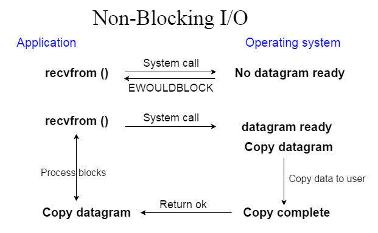

[原文地址](https://www.javatpoint.com/java-nio)
# Java NIO
Java提供了第二个称为NIO（新I/O）的I/O系统。 Java NIO提供了与标准I/O API相比使用I/O的不同方式。 它是Java的备用I/O API（来自Java 1.4）。

它支持面向缓冲区的基于通道的I/O操作方法。 随着JDK 7的推出，NIO系统得到扩展，为文件系统功能和文件处理提供了增强的支持。 由于NIO文件类支持的功能，NIO广泛用于文件处理。

NIO的开发目标是允许Java程序员在不使用自定义本机代码的情况下实现高速I/O。 NIO将耗时的I/O活动（如填充，即缓冲区等）移回操作系统，从而大大提高了操作速度。

Java NIO的基本组件如下：

- 通道和缓冲区：在标准I/O API中，使用字符流和字节流。 在NIO，我们使用通道和缓冲区。 数据总是从缓冲区写入通道，并从通道读取到缓冲区。
- 选择器：Java NIO提供了“选择器”的概念。 它是一个可用于监视多个通道的对象，例如数据到达，连接打开等。因此，单线程可以监视多个通道的数据。
- 非阻塞I/O：Java NIO提供了非阻塞I/O功能。 在这里，应用程序立即返回任何可用的数据，应用程序应该有池化机制以在更多数据准备好时得知。

让我们来看看非阻塞I/O的应用和操作系统接口：

