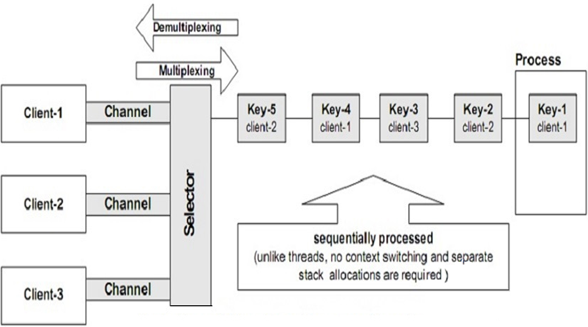

[原文地址](https://www.javatpoint.com/java-nio-socketchannel)
# Java NIO SocketChannel
Java NIO SocketChannel用于连接具有TCP（传输控制协议）网络套接字的通道。 它等同于网络编程中使用的Java网络套接字。

有两种方法可用于在Java NIO中创建SocketChannel：
- 它可以在传入连接到达ServerSocketChannel时创建。
- 我们可以使用互联网打开一个SocketChannel并与任何地方的服务器连接。

我们来看看使用选择器的SocketChannel客户端 - 服务器通信的框图：


## 关闭SocketChannel
通过调用SocketChannel.close（）方法执行所有操作后，我们可以关闭SocketChannel。

用于关闭套接字通道的语法是：
```
SocketChannel.close();   
```

## 打开SocketChannel
我们可以通过调用SocketChannel.Open（）方法来打开一个SocketChannel。

用于打开套接字通道的语法是：
```
SocketChannel sc = SocketChannel.open();  
sc.connect(new InetSocketAddress("http://javatpoint.com", 70));  
```

## 从SocketChannel读取

为了读取来自SocketChannel的数据，我们调用read（）方法之一。

我们来看看从SocketChannel读取数据的例子：
```
ByteBuffer bb = ByteBuffer.allocate(84);  
int bytesRead = SocketChannel.read(bb);  
```
首先分配缓冲区。 从SocketChannel读取的数据存储在缓冲区中。

其次我们调用SocketChannel.read（）方法，它将SocketChannel中的数据读入缓冲区。 read（）方法的整数值返回写入缓冲区的字节数。

## 写入SocketChannel
为了将数据写入SocketChannel，使用SocketChannel.write（）方法，并将缓冲区作为参数。

我们来看看将数据写入SocketChannel的例子：
```
String newData = "The new String is writing in a file ..." + System.currentTimeMillis();  
ByteBuffer bb= ByteBuffer.allocate(48);  
bb.clear();  
bb.put(newData.getBytes());  
bb.flip();  
while(bb.hasRemaining()) {  
    SocketChannel.write(bb);  
}  
```
SocketChannel.write（）方法在while循环中使用，因为write（）方法写入SocketChannel的字节数目是未知的，因此我们重复write（）方法，直到Buffer没有更多字节可用于写入。
