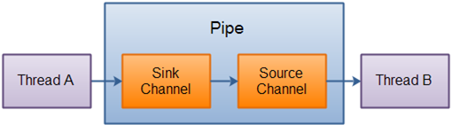

[原文地址](https://www.javatpoint.com/java-nio-pipe)
# Java NIO 管道
Java NIO Pipe用于在两个线程之间建立单向数据连接。 它有一个接收通道和源通道。 数据正在写入接收器通道，然后可以从源通道读取该数据。

在Java NIO中，包java.nio.channel.pipe用于按顺序读取和写入数据。 管道用于确保必须按照写入管道的相同顺序读取数据。

让我们来看管道工作原理的框图说明：


## 创建管道
为了创建管道，我们需要通过调用Pipe.open（）方法来打开管道。

用于打开或创建管道的语法是：
```
Pipe pp = Pipe.open();  
```
## 从管道读取
为了从管道读取数据，我们需要访问源通道。 因此用于访问源通道的语法是：
```
Pipe.SourceChannel sc= pipe.source();  
```
为了从SourceChannel读取数据，我们调用read（）方法，如下所示：
```
ByteBuffer bb= ByteBuffer.allocate(512);  
int bytesRead = inChannel.read(bb);  
```
read（）方法返回的整数值用于确定读入缓冲区的字节数。
## 写入管道
为了将数据写入管道，我们需要访问接收器通道。 因此，用于访问宿信道的语法是：
```
Pipe.SinkChannel sc= pipe.sink();  
```
为了将数据写入SinkChannel，我们调用下面给出的write（）方法：
```
String newData = "The new String is writing in a Pipe..." + System.currentTimeMillis();  
ByteBuffer bb= ByteBuffer.allocate(512);  
bb.clear();  
bb.put(newData.getBytes());  
bb.flip();  
while(bb.hasRemaining()) {  
SinkChannel.write(bb);  
}  
```
## 基本管道示例

```
package com.javatpoint;  

import java.io.IOException;  
import java.nio.ByteBuffer;  
import java.nio.channels.Pipe;  
public class PipeExample {  
  public static void main(String[] args) throws IOException {  
      //The Pipe is created  
      Pipe pipe = Pipe.open();  
      //For accessing the pipe sink channel   
      Pipe.SinkChannel skChannel = pipe.sink();  
      String td = "Data is successfully sent for checking the java NIO Channel Pipe.";  
ByteBuffer bb = ByteBuffer.allocate(512);  
      bb.clear();  
      bb.put(td.getBytes());  
      bb.flip();  
       //write the data into a sink channel.  
      while(bb.hasRemaining()) {  
          skChannel.write(bb);  
      }  
      //For accessing the pipe source channel  
      Pipe.SourceChannel sourceChannel = pipe.source();  
      bb = ByteBuffer.allocate(512);  
     //The data is write to the console     
      while(sourceChannel.read(bb) > 0){  
          bb.flip();  

          while(bb.hasRemaining()){  
              char TestData = (char) bb.get();  
              System.out.print(TestData);  
          }  
          bb.clear();  
      }  
  }  
}  
```

输出：
Data is successfully sent for checking the java NIO Channel Pipe.  
