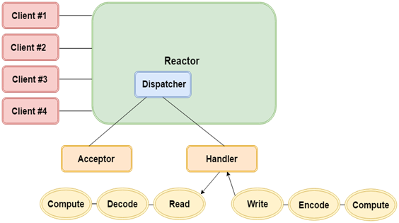

[原文地址](https://www.javatpoint.com/encode-and-decode-in-java-nio)
# Java NIO中编码和解码
使用Java NIO API编码和解码操作可以从一个Charset执行到另一个Charset。 这两个类的CharsetEncoder和CharsetDecoder在ByteBuffer和CharBuffer之间的编码和解码中起着重要的作用。

只有当处理程序可用时，反应堆才会保持到达事件的追踪和分派。 我们来看看在reactor中执行的编码和解码操作的架构：


## Java NIO中的CharsetEncoder
CharsetEncoder用于将Unicode字符编码为字节序列。 它还返回提供任何错误信息的CoderResult。

## Java NIO中的CharsetDecoder
CharsetDecoder用于将数组或字节序列解码为Unicode字符。 在从ByteBuffer到CharBuffer的解码期间，获得CoderResult。 CoderResult

## Java NIO中的Charset.newEncoder（）
在CharsetEncoder中，Charset.newEncoder（）用于创建Charset对象，然后通过newEncoder（）方法获得CharsetEncoder的对象。

## Java NIO中的Charset.newDecoder（）
在CharsetDecoder中，Charset.newDecoder（）用于创建Charset对象，然后通过newDecoder（）方法获得CharsetDecoder的一个对象

## 基本的编码和解码示例
```
package com.javatpoint;  
import java.nio.ByteBuffer;  
import java.nio.CharBuffer;  
import java.nio.charset.Charset;  
import java.nio.charset.CharacterCodingException;  
import java.nio.charset.CharsetDecoder;  
import java.nio.charset.CharsetEncoder;  

public class CharsetExample {  
public static void main(String[] args) throws CharacterCodingException {  
    Charset cs = Charset.forName("UTF-8");  
    CharsetDecoder csdecoder = cs.newDecoder();  
    CharsetEncoder csencoder = cs.newEncoder();  
    String st = "Example of Encode and Decode in Java NIO.";  
    ByteBuffer bb= ByteBuffer.wrap(st.getBytes());  
    CharBuffer cb = csdecoder.decode(bb);  
    ByteBuffer newbb = csencoder.encode(cb);   
    while(newbb.hasRemaining()){  
           char ca = (char) newbb.get();  
           System.out.print(ca);  
         }  
    newbb.clear();    
    }  
}  
```

输出：
```
Example of Encode and Decode in Java NIO.  
```
