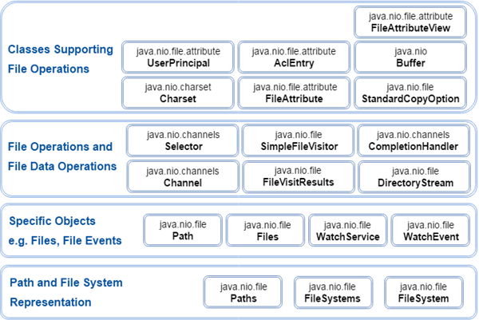

[原文地址](https://www.javatpoint.com/java-nio-package)
# Java NIO 包
NIO类包含在一个名为java.nio包的包中。 理解NIO子系统不会替代java.io包中可用的基于流的I/O类非常重要，并且对java.io中基于流的I/O的深入了解有助于理解NIO。

下面显示了按不同类别分组的重要NIO类：

以上组是基于从开发人员角度来看NIO类的用途。 此分组背后的目的是文件系统的表示或与文件系统的交互级别。

NIO类包含在软件包中，如下所示：

| 包 | 目的     |
| :------------- | :------------- |
| java.nio | 它是NIO系统的顶级软件包。 这个NIO系统封装了各种类型的缓冲区。|
| java.nio.charset | 它封装了字符集，并且还支持分别将字符转换为字节和字节的编码器和解码器操作。|
| java.nio.charset.spi | 它提供字符集的服务提供者。      |
| java.nio.channels | 它提供通道，它基本上打开了I/O连接。 |
| java.nio.channels.spi |它提供通道的服务提供商。|
| java.nio.file |它提供了对文件的支持。|
| java.nio.file.spi | 它提供文件系统的服务提供商。|
| java.nio.file.attribute | 它提供对文件属性的支持。|
