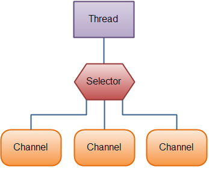

[原文地址](https://www.javatpoint.com/java-nio-vs-input-output)
# Java IO vs. NIO
让我们看一下显示Java IO和NIO之间主要区别的表格：

| IO | NIO |
| :------------- | :------------- |
| 它基于阻塞I/O操作      | 它基于非阻塞I/O操作     |
| 它是面向流     | 它面向缓冲区     |
| 通道不可用     | 通道可用于非阻塞I/O操作    |
| 选择器不可用     | 选择器可用于非阻塞I/O操作    |

## 阻塞I/O与非阻塞I/O对比

### 阻塞I/O

阻止IO在返回之前等待数据写入或读取。 Java IO的各种流都被阻塞。 它意味着当线程调用write（）或read（）时，线程被阻塞，直到有一些数据可供读取，或者数据完全写入。

### 非阻塞I/O
非阻塞IO不会在返回之前等待数据读取或写入。 Java NIO非阻塞模式允许线程请求将数据写入一个通道，但不能等待它完全写入。 线程被允许继续并在同一时间做其他事情。

## 面向流 和 面向缓冲区 的对比
### 面向流
Java IO是面向流的I/O意味着我们需要从流中一次读取一个或多个字节。 它使用流在数据源/接收器和Java程序之间传输数据。 使用这种方法的I/O操作很慢。


让我们看一下在java程序中使用输入/输出流的数据流：
### 面向缓冲区
Java NIO是面向缓冲区的I/O方法。 数据被读入缓冲区，通过该缓冲区进一步处理数据。 在NIO中，我们处理I/O操作的通道和缓冲区。

通道和流之间的主要区别是：
- 流可用于单向数据传输。
- 一个通道提供了一个双向数据传输设施。

因此，通过在java NIO中引入通道，可以执行非阻塞I/O操作。

让我们看看通道，缓冲区，Java程序，数据源和数据接收器之间的交互：


## 通道
在Java NIO中，通道是在实体和字节缓冲区之间有效传输数据的介质。 它从一个实体读取数据并将其放入缓冲区块以供使用。

通道充当由java NIO提供的访问I/O机制的网关。 通常，通道与操作系统文件描述符具有一对一的关系，以提供平台独立操作功能。

### NIO通道基础
通道实现使用本机代码来执行实际工作。 通道接口使我们能够以便携和受控的方式访问低级别的I/O服务。

在层次结构的顶部，使用Channel接口，如下所示：
```
package java.nio.channels;  
 public interface Channel{  
    public boolean isclose();  
    public void open() throws IOException;  
}  
```
正如我们在上面的通道接口中看到的，所有通道中常见的两种操作是：
- 检查通道是否关闭（isclose()）
- 打开关闭的通道（open()）

## 选择器
在Java NIO中，选择器是可选通道的多路复用器，用作可以进入非阻塞模式的特殊类型的通道。 它可以检查一个或多个NIO通道并确定哪个通道准备好进行通信，如：读取或写入。

### 选择器的用途是什么？
选择器用于使用单个线程处理多个通道。 因此它需要较少的线程来处理通道。

在线程之间切换对于操作系统而言是昂贵的。 因此，对于提高系统效率的选择器是有用的。

让我们看看使用Selector处理3个Channel的线程的图示：



### 创建一个选择器
我们可以通过调用Selector.open（）方法创建一个选择器，如下所示：
```
Selector selector = Selector.open();  
```
