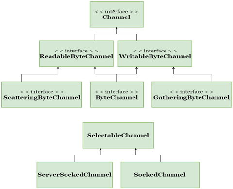

[原文地址](https://www.javatpoint.com/java-nio-channels)
# Java NIO 通道
在Java NIO中，通道是用于在实体和字节缓冲区之间高效传输数据的介质。 它从一个实体读取数据并将其放入缓冲区块以供使用。

通道充当由java NIO提供的访问I / O机制的网关。 通常，通道与操作系统文件描述符具有一对一的关系，以提供平台独立操作功能。

我们来看看java.nio.channels的类层次结构：



上述通道可以用于阻塞或非阻塞模式，但我们主要关注在非阻塞模式下使用通道。
## NIO频道基础
通道实现使用本机代码来执行实际工作。 通道接口使我们能够以便携和受控的方式访问低级别的I / O服务。

在层次结构的顶部，使用Channel接口，如下所示：
```
package java.nio.channels;  
 public interface Channel{  
    public boolean isclose();  
    public void open() throws IOException;  
}  
```
正如我们在上面的通道界面中看到的，所有通道只有两个通用操作：
- 检查通道是否关闭（isclose（））
- 打开关闭通道（open（））

## Channel 实现类
在Java NIO中，使用的主要通道如下所示：
- FileChannel：文件通道用于从文件中读取数据。 它的对象只能通过调用getChannel（）方法来创建。 我们不能直接创建FileChannel对象。  
让我们来看看创建FileChannel对象的例子：
```
FileInputStream fis = new FileInputStream("D:\\testin.txt"); // Path of Input text file  
ReadableByteChannel rbc = fis.getChannel();  
```
- DatagramChannel：数据报通道可以通过UDP（用户数据报协议）在网络上读写数据。 它使用工厂方法创建新对象。  
用于打开DatagramChannel的语法：
```
DatagramChannel ch = DatagramChannel.open();  
```
用于关闭DatagramChannel的语法：
```
DatagramChannel ch = DatagramChannel.close();  
```
- SocketChannel：数据报通道可以通过TCP（传输控制协议）在网络上读写数据。 它还使用工厂方法来创建新对象。  
用于打开SocketChannel的语法：
```
SocketChannel ch = SocketChannel.open();  
ch.connect(new InetSocketAddress("somehost", someport));  
```
用于关闭SocketChannel的语法：
```
SocketChannel ch = SocketChannel.close();  
ch.connect(new InetSocketAddress("somehost", someport));  
```
- ServerSocketChannel：ServerSocketChannel允许用户监听传入的TCP连接，与Web服务器相同。 对于每个传入的连接，创建一个SocketChannel。   
用于打开ServerSocketChannel的语法：
```
ServerSocketChannel ch = ServerSocketChannel.open();  
ch.socket().bind (new InetSocketAddress (somelocalport));  
```
用于关闭ServerSocketChannel的语法：
```
ServerSocketChannel ch = ServerSocketChannel.close();  
ch.socket().bind (new InetSocketAddress (somelocalport));  
```

### 基本通道示例
我们来看看将数据从一个通道复制到另一个通道或从一个文件复制到另一个文件的示例：
```
package com.javatpoint;  

import java.io.FileInputStream;  
import java.io.FileOutputStream;  
import java.io.IOException;  
import java.nio.ByteBuffer;  
import java.nio.channels.ReadableByteChannel;  
import java.nio.channels.WritableByteChannel;  
 public class Index {  
    public static void main(String args[]) throws IOException {  
        FileInputStream input = new FileInputStream ("D:\\testin.txt"); // Path of Input text file  
        ReadableByteChannel source = input.getChannel();  
        FileOutputStream output = new FileOutputStream ("D:\\testout.txt"); // Path of Output text file  
        WritableByteChannel destination = output.getChannel();  
        copyData(source, destination);  
        source.close();  
        destination.close();  
    }  
    private static void copyData(ReadableByteChannel src, WritableByteChannel dest) throws IOException {  
      ByteBuffer buffer = ByteBuffer.allocateDirect(20 * 1024);  
      while (src.read(buffer) != -1){  
          // The buffer is used to drained  
          buffer.flip();  
          // keep sure that buffer was fully drained  
          while (buffer.hasRemaining())   
          {  
              dest.write(buffer);  
          }  
          buffer.clear(); // Now the buffer is empty, ready for the filling  
      }  
    }  
}  
```
输出：  
上述程序将文本文件testin.txt的内容复制到另一个文本文件testout.txt中。
