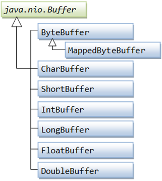

[原文地址](https://www.javatpoint.com/java-nio-buffers)
# Java NIO 缓冲区
缓冲区在java.nio包中定义。 它定义了所有缓冲区通用的核心功能：限制，容量和当前位置。

Java NIO缓冲区用于与NIO通道交互。 这是我们可以写入数据的内存块，我们以后可以再次读取它。 内存块包含一个NIO缓冲区对象，该对象提供了更简单的方法来处理内存块。
### 缓冲区类型
对于每种原始类型都有一个缓冲区类型，所有缓冲区类都可以实现缓冲区接口。 最常用的缓冲区类型是ByteBuffer。

在Java NIO中使用的核心缓冲区如下所示：
- CharBuffer
- DoubleBuffer
- IntBuffer
- LongBuffer
- ByteBuffer
- ShortBuffer
- FloatBuffer

上面的缓冲区覆盖了我们可以通过I/O发送的基本数据类型：字符，double，int，long，byte，short和float。

在NIO中，通过使用java.nio.Buffer类中实现的缓冲区进行数据传输。 它与阵列类似，具有固定容量。



### 分配一个缓冲区
为了获得一个缓冲区对象，我们必须首先分配一个缓冲区。 在每个Buffer类中，allocate（）方法用于分配缓冲区。

我们来看一个示例，显示ByteBuffer的分配，容量为28个字节：
```
ByteBuffer buf = ByteBuffer.allocate(28);  
```
让我们看一下显示CharBuffer分配的例子，空间为2048个字符：
```
CharBuffer buf = CharBuffer.allocate(2048);  
```
### 从缓冲区读取数据
有两种方法可以从缓冲区中读取数据：
- 使用get（）方法之一读取Buffer中的数据。
- 将Buffer中的数据读入通道。

让我们看看使用get（）方法从Buffer读取数据的示例：
```
byte aByte = buf.get();   
```
我们来看看将Buffer中的数据读入通道的例子：
```
int bytesWritten = inChannel.write(buf);  
```
### 将数据写入缓冲区
有两种将数据写入缓冲区的方法：
1. 使用put（）方法之一将数据写入缓冲区。
2. 将通道中的数据写入缓冲区。

### 基本缓冲区示例
我们来看看使用BufferedReader从testout.txt文件中读取行的简单示例：
```
package com.javatpoint;  
import java.io.BufferedReader;  
import java.io.IOException;  
import java.io.InputStream;  
import java.io.InputStreamReader;  
import java.nio.file.Files;  
import java.nio.file.Path;  
import java.nio.file.Paths;  

public class Index {  
        public static void main(String[] args) {  
        Path file = null;  
        BufferedReader bufferedReader = null;  
        try {  
            file = Paths.get("D:\\testout.txt");  
            InputStream inputStream = Files.newInputStream(file);  
            bufferedReader = new BufferedReader(new InputStreamReader(inputStream));  
            System.out.println("Reading the Line of testout.txt file: "+ bufferedReader.readLine());  
        } catch (IOException e) {  
            e.printStackTrace();  
        } finally {  
            try {  
                bufferedReader.close();  
            } catch (IOException ioe) {  
                ioe.printStackTrace();  
            }  
        }  
    }  
 }  
```
输出  
上述程序读取testout.txt文件的第一行，然后在控制台上打印第一行文件。
