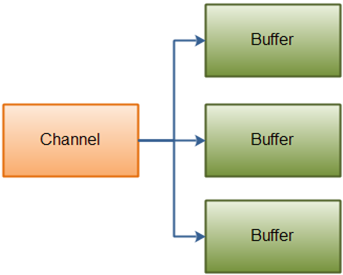
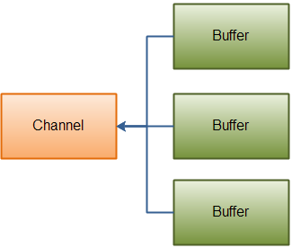

[原文地址](https://www.javatpoint.com/scatter-gather-or-vectored-input-output)
# 分散/聚集或向量化I/O
在Java NIO中，通道提供了一种称为分散/聚集或向量化I/O的重要功能。 它是一种简单而强大的技术，通过这种技术，可以使用单个write（）函数将字节从一组缓冲区写入到一个流中，并且可以使用单个read（）函数将字节读取到一组缓冲区中。

Java NIO具有内置的分散/聚集支持。 它可用于读取通道和写入通道。
## 分散读取
'分散读取'用于将数据从单个通道读入多个缓冲区。

让我们看看分散原理的例子：



我们来看看执行分散读取操作的代码示例：
```
public interface ScatteringByteChannel extends ReadableByteChannel  
{  
    public long read (ByteBuffer [] argv) throws IOException;  
    public long read (ByteBuffer [] argv, int length, int offset) throws IOException;  
}  
```
## 聚集写入
“聚集写入”用于将来自多个缓冲区的数据写入单个通道。

让我们看一下聚集原理的简单例证：



我们来看看执行聚集写入操作的代码示例：
```
public interface GatheringByteChannel extends WritableByteChannel  
{  
    public long write(ByteBuffer[] argv) throws IOException;  
    public long write(ByteBuffer[] argv, int length, int offset) throws IOException;  
}  
```
##基本分散/聚集的示例
让我们看看两个缓冲区的简单例子。 第一个缓冲区保存一个随机数，第二个缓冲区保存要使用分散/聚集机制写入的数据：
```
package com.javatpoint;  
import java.io.FileOutputStream;  
import java.io.FileInputStream;  
import java.nio.ByteBuffer;  
import java.nio.channels.FileChannel;  
import java.nio.channels.ScatteringByteChannel;  
import java.nio.channels.GatheringByteChannel;  
public class Index  
{  
public static void main(String params[])   
    {  
        String data = "Scattering and Gathering example shown in javatpoint.com";  
         gatherBytes(data);  
        scatterBytes();  
    }  
     /* gatherBytes() is used for reading the bytes from the buffers and write it to a file channel.
     */  
    public static void gatherBytes(String data)   
    {  
        //The First Buffer is used for holding a random number  
        ByteBuffer buffer1 = ByteBuffer.allocate(8);  
        //The Second Buffer is used for holding a data that we want to write  
        ByteBuffer buffer2 = ByteBuffer.allocate(400);  
        buffer1.asIntBuffer().put(420);  
        buffer2.asCharBuffer().put(data);  
        GatheringByteChannel gatherer = createChannelInstance("D:\\testout.txt", true);  
        //Write the data into file  
        try  
        { gatherer.write(new ByteBuffer[] { buffer1, buffer2 });  
        }   
        catch (Exception e)   
        { e.printStackTrace();  
        }  
    }  
    /* scatterBytes() is used for reading the bytes from a file channel into a set of buffers.
     */  
    public static void scatterBytes()   
    {  
        //The First Buffer is used for holding a random number  
        ByteBuffer buffer1 = ByteBuffer.allocate(8);  
         //The Second Buffer is used for holding a data that we want to write  
        ByteBuffer buffer2 = ByteBuffer.allocate(400);  
        ScatteringByteChannel scatter = createChannelInstance("D:\\testout.txt", false);  
      //Reading a data from the channel  
        try  
        { scatter.read(new ByteBuffer[] { buffer1, buffer2 });  
        }   
        catch (Exception e)   
        { e.printStackTrace();  
        }  
       //Read the two buffers seperately  
        buffer1.rewind();  
        buffer2.rewind();  

        int bufferOne = buffer1.asIntBuffer().get();  
        String bufferTwo = buffer2.asCharBuffer().toString();  
        //Verification of content  
        System.out.println(bufferOne);  
        System.out.println(bufferTwo);  
    }  
     public static FileChannel createChannelInstance(String file, boolean isOutput)   
    {  
        FileChannel FChannel = null;  
        try  
        {  
            if (isOutput) {  
                FChannel = new FileOutputStream(file).getChannel();  
            } else {  
                FChannel = new FileInputStream(file).getChannel();  
            }  
        }   
        catch (Exception e) {  
            e.printStackTrace();  
        }  
        return FChannel;  
    }  
}  
```
输出
在上述程序中，第一个缓冲区在控制台上打印随机输出，第二个缓冲区在控制台上打印“Scattering and Gathering example shown in javatpoint.com”。

它还用“Scattering and Gathering example shown in javatpoint.com”替换testout.txt文件的内容。
