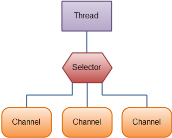
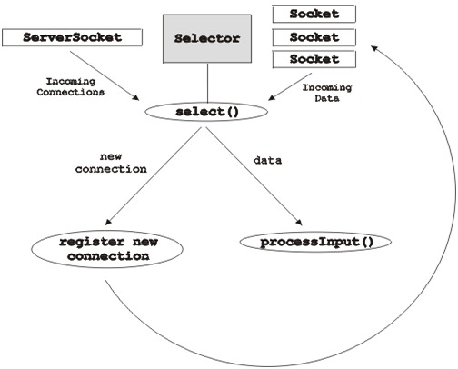

[原文地址](https://www.javatpoint.com/java-nio-selector)
# Java NIO 选择器
在Java NIO中，选择器是可选通道的多路复用器，用作可以进入非阻塞模式的特殊类型的通道。 它可以检查一个或多个NIO通道并确定哪个通道准备好进行通信，即读取或写入。
## Selector有什么用途？
选择器用于使用单个线程处理多个通道。 因此它需要更少的线程来处理通道。 在线程之间切换对于操作系统而言是昂贵的。 因此，为了提高系统效率，这是使用。

让我们看看使用Selector处理3个Channel的线程的图示：

让我们看一下聚集原理的简单例证：


## 创建一个选择器
我们可以通过调用Selector.open（）方法创建一个选择器，如下所示：
```
Selector selector = Selector.open();  
```
## 打开服务器套接字通道
我们来看看打开服务器套接字通道的例子：
```
ServerSocketChannel serverSocket = ServerSocketChannel.open();  
InetSocketAddress hostAddress = new InetSocketAddress("localhost", 8080);  
serverSocket.bind(hostAddress);  
```

## 使用选择器选择通道
在向选择器注册一个或多个通道时，我们可以调用select（）方法之一。 该方法返回一个准备好我们要执行的事件的通道，即连接，读取，写入或接受。

可用于选择通道的各种select（）方法是：
- int select（）：select（）方法返回的整数值告知有多少信道已准备好进行通信。
- int select（long TS）：此方法与select（）相同，只是它阻塞最大TS（毫秒）时间段内的输出。
- int selectNow（）：它不会阻塞输出，并立即返回任何准备就绪的通道。

selectedKeys()

一旦我们调用了select（）方法中的任何一个，并且它将返回一个值，表示一个或多个通道已准备好，那么我们可以通过使用selected key set来访问ready channels，通过调用选择器selectedkeys()方法如下：
```
Set<SelectionKey> selectedKeys = selector.selectedKeys();  
```
我们可以遍历所选的按键集以访问就绪通道，如下所示：
```
Set<SelectionKey> selectedKeys = selector.selectedKeys();  
Iterator<SelectionKey> keyIterator = selectedKeys.iterator();  
while(keyIterator.hasNext()) {    
    SelectionKey key = keyIterator.next();  
    if(key.isConnectable()) {  
        // The connection was established with a remote server.  
    } else if (key.isAcceptable()) {  
        // The connection was accepted by a ServerSocketChannel.  
    } else if (key.isWritable()) {  
        //  The channel is ready for writing  
    } else if (key.isReadable()) {  
        // The channel is ready for reading  
    }  
    keyIterator.remove();  
}  
```
上述循环迭代所选键集中的键以确定使用所选频道执行的操作。

完整的选择回路框图如下所示：



## 基本选择器示例
主程序
```
package com.javatpoint;  

import java.nio.channels.ServerSocketChannel;  
import java.nio.channels.SocketChannel;  
import java.nio.channels.Selector;  
import java.nio.channels.SelectionKey;  
import java.nio.ByteBuffer;  
import java.io.IOException;  
import java.util.Set;  
import java.util.Iterator;  
import java.net.InetSocketAddress;  
public class SelectorExample {  
   public static void main (String [] args)  
            throws IOException {  
        // Get the selector  
        Selector selector = Selector.open();  
        System.out.println("Selector is open for making connection: " + selector.isOpen());  
        // Get the server socket channel and register using selector  
        ServerSocketChannel SS = ServerSocketChannel.open();  
        InetSocketAddress hostAddress = new InetSocketAddress("localhost", 8080);  
        SS.bind(hostAddress);  
        SS.configureBlocking(false);  
        int ops = SS.validOps();  
        SelectionKey selectKy = SS.register(selector, ops, null);  
        for (;;) {  
            System.out.println("Waiting for the select operation...");  
            int noOfKeys = selector.select();  
            System.out.println("The Number of selected keys are: " + noOfKeys);  
            Set selectedKeys = selector.selectedKeys();  
            Iterator itr = selectedKeys.iterator();  
            while (itr.hasNext()) {  
                SelectionKey ky = (SelectionKey) itr.next();  
                if (ky.isAcceptable()) {  
                    // The new client connection is accepted  
                    SocketChannel client = SS.accept();  
                    client.configureBlocking(false);  
                    // The new connection is added to a selector  
                    client.register(selector, SelectionKey.OP_READ);  
                    System.out.println("The new connection is accepted from the client: " + client);  
                }  
                else if (ky.isReadable()) {  
                    // Data is read from the client  
                    SocketChannel client = (SocketChannel) ky.channel();  
                    ByteBuffer buffer = ByteBuffer.allocate(256);  
                    client.read(buffer);  
                    String output = new String(buffer.array()).trim();  
                    System.out.println("Message read from client: " + output);  
                    if (output.equals("Bye Bye")) {  
                        client.close();  
                        System.out.println("The Client messages are complete; close the session.");  
                    }  
                }  
                itr.remove();  
            } // end of while loop  
        } // end of for loop  
    }  
}  
```
客户端程序
```
package com.javatpoint;  

import java.nio.channels.SocketChannel;  
import java.nio.ByteBuffer;  
import java.io.IOException;  
import java.net.InetSocketAddress;  
public class Client {  
    public static void main (String [] args)  
            throws IOException, InterruptedException {  
        InetSocketAddress hA = new InetSocketAddress("localhost", 8080);  
        SocketChannel client = SocketChannel.open(hA);  
        System.out.println("The Client is sending messages to server...");  
        // Sending messages to the server     
        String [] msg = new String [] {"Time goes fast.", "What next?", "Bye Bye"};  
        for (int j = 0; j < msg.length; j++) {  
            byte [] message = new String(msg [j]).getBytes();  
            ByteBuffer buffer = ByteBuffer.wrap(message);  
            client.write(buffer);  
            System.out.println(msg [j]);  
            buffer.clear();  
            Thread.sleep(3000);  
        }  
        client.close();               
    }  
}
```
输出：
主程序输出：
```
Selector is open for making connection: true  
Waiting for the select operation...  
The Number of selected keys are: 1  
The new connection is accepted from the client: java.nio.channels.SocketChannel[connected   

local=/127.0.0.1:8080 remote=/127.0.0.1:51367]  
Waiting for the select operation...  
The Number of selected keys are: 1  
Message read from client: Time goes fast.  
Waiting for the select operation...  
The Number of selected keys are: 1  
Message read from client: What next?  
Waiting for the select operation...  
The Number of selected keys are: 1  
Message read from client: Bye Bye  
The Client messages are complete; close the session.  
Waiting for the select operation...  
```
客户端程序输出
```
The Client is sending messages to server...  
Time goes fast.  
What next?  
Bye Bye  
```
