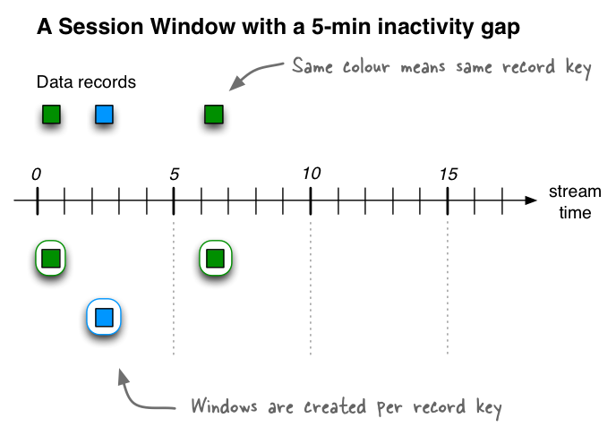
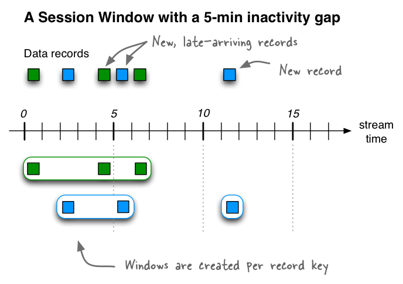

[原文地址](https://kafka.apache.org/10/documentation/streams/developer-guide/dsl-api.html)

# 流领域特定语言
Kafka Streams DSL（域特定语言）构建在Streams Processor API之上。 这是大多数用户推荐的，特别是初学者。 大多数数据处理操作都可以用几行DSL代码来表示。
## 概述
与处理器API相比，只有DSL支持：
- 内置KStream，KTable和GlobalKTable形式的流和表的抽象。 拥有流和表的一流支持是至关重要的，因为在实践中，大多数用例不仅需要流或数据库/表，而且还需要两者的组合。 例如，如果您的用例是创建实时更新的客户360度视图，那么您的应用程序将会将许多与客户相关的事件输入流转换为包含不断更新的360度视图的输出表 客户的观点。
- 具有[无状态变换](https://kafka.apache.org/10/documentation/streams/developer-guide/dsl-api.html#streams-developer-guide-dsl-transformations-stateless)（例如map和filter）以及诸如聚集（例如count:计数和reduce:减少），连接（例如，leftJoin:左连接）和窗口化（例如session window:会话窗口）的[有状态变换](https://kafka.apache.org/10/documentation/streams/developer-guide/dsl-api.html#streams-developer-guide-dsl-transformations-stateful)的声明性，函数式编程风格。

使用DSL，您可以在应用程序中定义处理器拓扑（即逻辑处理计划）。 完成这个步骤是：
1. 指定[一个或多个从Kafka主题读取的输入流](https://kafka.apache.org/10/documentation/streams/developer-guide/dsl-api.html#streams-developer-guide-dsl-sources)。
2. 在这些流上组合[转换](https://kafka.apache.org/10/documentation/streams/developer-guide/dsl-api.html#streams-developer-guide-dsl-transformations)。
3. 将[结果输出流写回到Kafka主题](https://kafka.apache.org/10/documentation/streams/developer-guide/dsl-api.html#streams-developer-guide-dsl-destinations)，或通过[交互式查询](https://kafka.apache.org/10/documentation/streams/developer-guide/interactive-queries.html#streams-developer-guide-interactive-queries)（例如，通过REST API）将应用程序的处理结果直接公开给其他应用程序。

在应用程序运行之后，定义的处理器拓扑结构被连续地执行（即处理计划付诸实施）。 下面提供了使用DSL编写流处理应用程序的分步指南。

有关可用API功能的完整列表，请参阅[Kafka Streams Javadocs](https://kafka.apache.org/10/documentation/streams/javadocs.html#streams-javadocs)。

## 创建来自KAFKA的源流
您可以轻松地从Kafka主题中读取数据到您的应用程序中。 支持以下操作。

从Kafka读取 | 描述
---- | ---
Stream  <br /><br />  input topics → KStream| 从指定的Kafka输入主题创建KStream，并将数据解释为记录流。 KStream表示分区的记录流。 （细节）<br/><br />在KStream的情况下，每个应用程序实例的本地KStream实例将仅填充来自输入主题的一部分分区的数据。 总而言之，在所有应用程序实例中，读取和处理所有输入主题分区。<br /><br />[代码参考](https://kafka.apache.org/10/documentation/streams/developer-guide/dsl-api.html)<br /><br />如果您没有明确指定SerDes，则使用配置中的默认SerDes。 <br /><br />如果Kafka输入主题中的记录的键或值类型与配置的默认SerDes不匹配，则必须明确指定SerDes。 有关配置默认SerDes，可用SerDes和实现您自己的自定义SerDes的信息，请参阅数据类型和序列化。 <br /><br /> 存在多个流的变体，例如，为输入主题指定正则表达式模式。
Table <br /><br /> input topic → KTable|将指定的Kafka输入主题读入KTable。该主题被解释为更改日志流，其中具有相同键的记录被解释为对于该键的UPSERT aka INSERT / UPDATE（当记录值不为空时）或DELETE（当值为空时）。 （细节）<br /><br />在KStream的情况下，每个应用程序实例的本地KStream实例将仅填充来自输入主题的一部分分区的数据。总而言之，在所有应用程序实例中，读取和处理所有输入主题分区。<br /><br />您必须为该表提供一个名称（更确切地说，对于支持该表的内部状态存储）。这对于支持对表的交互式查询是必需的。如果没有提供名称，表格将不会被查询，并且会为状态存储提供一个内部名称。<br /><br />如果您没有明确指定SerDes，则使用配置中的默认SerDes。<br /><br />如果Kafka输入主题中的记录的键或值类型与配置的默认SerDes不匹配，则必须明确指定SerDes。有关配置默认SerDes，可用SerDes和实现您自己的自定义SerDes的信息，请参阅[数据类型和序列化](https://kafka.apache.org/10/documentation/streams/developer-guide/datatypes.html#streams-developer-guide-serdes)。<br /><br />存在多种表格变体，例如指定从输入主题读取时要使用的auto.offset.reset策略。
Global Table<br /><br />input topic → GlobalKTable|将指定的Kafka输入主题读取到GlobalKTable中。 该主题被解释为更改日志流，其中具有相同键的记录被解释为对于该键的UPSERT aka INSERT / UPDATE（当记录值不为空时）或DELETE（当值为空时）。 （细节）<br /><br />在GlobalKTable的情况下，每个应用程序实例的本地GlobalKTable实例将仅填充来自输入主题的一部分分区的数据。 总而言之，在所有应用程序实例中，读取和处理所有输入主题分区。<br /><br />您必须为该表提供一个名称（更确切地说，对于支持该表的内部状态存储）。 这对于支持对表的交互式查询是必需的。 如果没有提供名称，表格将不会被查询，并且会为状态存储提供一个内部名称。<br /><br />[代码参考](https://kafka.apache.org/10/documentation/streams/developer-guide/dsl-api.html)<br /><br />如果Kafka输入主题中的记录的键或值类型与配置的默认SerDes不匹配，则必须明确指定SerDes。 有关配置默认SerDes，可用SerDes和实现您自己的自定义SerDes的信息，请参阅数据类型和序列化。<br /><br />globalTable的几个变体存在于例如 指定显式SerDes。

## 流转换
KStream和KTable接口支持各种转换操作。 这些操作中的每一个都可以被转换成一个或多个连接的处理器到底层的处理器拓扑中。 由于KStream和KTable是强类型的，所有这些转换操作都被定义为通用函数，用户可以指定输入和输出数据类型。

一些KStream转换可能会生成一个或多个KStream对象，例如： - 过滤和映射KStream会生成另一个KStream - KStream上的分支可以生成多个KStream

其他一些可能会生成一个KTable对象，例如一个KStream的聚合也产生一个KTable。 这允许Kafka Streams在已经产生给下游转化操作员后的迟到记录到达时连续更新计算值。

所有KTable转换操作只能生成另一个KTable。 但是，Kafka Streams DSL确实提供了将KTable表示转换为KStream的特殊功能。 所有这些转换方法可以链接在一起组成一个复杂的处理器拓扑。

这些转换操作在以下小节中进行介绍：
- 无状态转换
- 有状态转换

### 无状态转换
无状态转换不需要状态进行处理，也不需要与流处理器相关联的状态存储。 Kafka 0.11.0和更高版本允许您实现无状态KTable转换的结果。 这允许通过交互式查询来查询结果。 为了实现KTable，下面的每个无状态操作都可以用一个可选的queryableStoreName参数来扩充。

转换|描述
----|---
分支<br /><br/>KStream → KStream[]|将基于提供的断言的KStream分支（或拆分）为一个或多个KStream实例。 （详情）<br /><br />断言按顺序进行评估。 记录被放置到第一个匹配的唯一一个输出流：如果第n个断言的计算结果为true，则记录被放置到第n个流。 如果没有断言匹配，记录将被删除。<br /><br />分支很有用，例如，可用于将记录路由到不同的下游主题。<br /><br />[代码参考](https://kafka.apache.org/10/documentation/streams/developer-guide/dsl-api.html)<br /><br />
过滤<br><br>KStream → KStream<br><br>KTable → KTable|`stream.filter`为每个元素计算布尔函数，并保留函数返回true的那些元素。 （KStream细节，KTable细节） <br /><br />[代码参考](https://kafka.apache.org/10/documentation/streams/developer-guide/dsl-api.html)<br /><br />
相反过滤器<br><br>KStream → KStream<br><br>KTable → KTable|`stream.filterNot`为每个元素计算布尔函数，并删除函数返回true的布尔函数。 （KStream细节，KTable细节） <br /><br />[代码参考](https://kafka.apache.org/10/documentation/streams/developer-guide/dsl-api.html)<br /><br />
FlatMap<br/><br/>KStream → KStream|取一条记录并生成零个，一个或多个记录。 您可以修改记录键和值，包括它们的类型。 （细节）<br/><br/>将数据流标记为数据重新分区：在flatMap之后应用分组或连接将导致重新分区记录。 如果可能，请使用flatMapValues，而不会导致数据重新分区。 <br /><br />[代码参考](https://kafka.apache.org/10/documentation/streams/developer-guide/dsl-api.html)<br /><br />
FlatMap (values only)<br><br>KStream → KStream|取一条记录并生成零个，一个或多个记录，同时保留原始记录的键。 您可以修改记录值和值类型。 （细节）<br><br>flatMapValues比flatMap更好，因为它不会导致数据重新分区。 但是，您不能像flatMap那样修改键或键类型。<br /><br />[代码参考](https://kafka.apache.org/10/documentation/streams/developer-guide/dsl-api.html)
Foreach <br><br>KStream → void<br><br>KStream → void<br><br>KTable → void|终端操作。 对每条记录执行无状态操作。 （细节）<br><br>你会使用foreach引起基于输入数据的副作用（类似于peek），然后停止对输入数据的进一步处理（不像peek，这不是终端操作）。<br><br>关于处理保证的注意事项：Kafka 无法追踪任何行为的副作用（如写入外部系统），这意味着他们通常不会从Kafka 的处理保证中受益。<br><br>[代码参考](https://kafka.apache.org/10/documentation/streams/developer-guide/dsl-api.html)
GroupByKey<br><br>KStream → KGroupedStream|按现有键对记录进行分组<br><br>分组是聚合流或表的先决条件，并确保数据被正确分区（“键入”）以供后续操作使用。<br><br>何时设置显式SerDes：存在groupByKey的变量以覆盖应用程序的已配置默认SerDes，如果生成的KGroupedStream的键和/或值类型与所配置的默认SerDes不匹配，则必须执行此操作。<br><br>注意<br><br>分组与窗口化：相关的操作是窗口化，它允许您控制如何将同一个键的分组记录“分组”到用于有状态操作（例如窗口化聚合或窗口化联接）的所谓窗口中。<br><br>导致数据重新分区当且仅当流标记为重新分区。 groupByKey优于groupBy，因为只有当流已经被标记为重新分区时，它才会重新分区数据。 但是，groupByKey不允许您修改像groupBy那样的键或键类型。。<br><br>[代码参考](https://kafka.apache.org/10/documentation/streams/developer-guide/dsl-api.html)
GroupBy<br><br>KStream → KGroupedStream<br><br>KTable → KGroupedTable|通过一个新的键分组记录，这可能是一个不同的键类型。 表分组时，您也可以指定一个新的值和值类型。 groupBy是selectKey（...）.groupByKey（）的简写。 （KStream细节，KTable细节）<br><br>分组是聚合流或表的先决条件，并确保数据被正确分区（“键入”）以供后续操作使用。<br><br>何时设置显式SerDes：存在groupBy的变体以覆盖应用程序的已配置默认SerDes，如果生成的KGroupedStream或KGroupedTable的键和/或值类型与已配置的默认SerDes不匹配，则必须执行此操作。<br><br>注意<br><br>分组与窗口化：窗口化操作，它允许您控制如何将同一个键的分组记录“分组”到用于有状态操作（例如窗口化聚合或窗口化联接）的所谓窗口中。<br><br>始终导致数据重新分区：groupBy总是导致数据重新分区。 如果可能，请使用groupByKey，只有在需要时才会重新分区数据。<br><br>[代码参考](https://kafka.apache.org/10/documentation/streams/developer-guide/dsl-api.html)
Map<br><br>KStream → KStream|取一条记录并产生一条记录。 您可以修改记录键和值，包括它们的类型。 （细节）<br><br>将流标记为数据重新分区：在映射之后应用分组或连接将导致重新分区记录。 如果可能的话，使用mapValues，这不会导致数据重新分区。<br><br>`stream.map`<br><br>[代码参考](https://kafka.apache.org/10/documentation/streams/developer-guide/dsl-api.html)
Map (values only)<br><br>KStream → KStream<br><br>KTable → KTable|取一条记录并产生一条记录，同时保留原始记录的键。 您可以修改记录值和值类型。 （KStream细节，KTable细节）<br><br>mapValues比map更好，因为它不会导致数据重新分区。 但是，它不允许您像`map`一样修改键或键类型。
Peek<br><br>KStream → KStream|对每条记录执行无状态操作，并返回未更改的流。 （细节）<br><br>你会使用`peek`导致基于输入数据（类似于foreach）的副作用，并继续处理输入数据（不像foreach，这是一个终端操作）。 peek按原样返回输入流; 如果您需要修改输入流，请改用map或mapValues。<br><br>对于诸如日志记录或跟踪指标或用于调试和故障排除的用例，peek很有帮助。<br><br>关于处理保证的注意事项：卡夫卡无法追踪任何行为的副作用（如写入外部系统），这意味着他们通常不会从卡夫卡的处理保证中受益。<br><br>[代码参考](https://kafka.apache.org/10/documentation/streams/developer-guide/dsl-api.html)
Print<br><br>KStream → void|终端操作。 将记录打印到System.out。 请参阅Javadocs的serde和toString（）注意事项。 （细节）<br><br>调用print（）和调用foreach（（key，value） - > System.out.println（key +“，”+ value））是一样的<br><br>[代码参考](https://kafka.apache.org/10/documentation/streams/developer-guide/dsl-api.html)
SelectKey<br><br>KStream → KStream|为每个记录分配一个新的键（可能是一个新的键类型）。 （细节）<br><br>调用selectKey（mapper）与调用map（（key，value） - > mapper（key，value），value）相同。<br><br>将数据流标记为数据重新分区：在selectKey之后应用分组或联接将导致重新分区记录。<br><br>[代码参考](https://kafka.apache.org/10/documentation/streams/developer-guide/dsl-api.html)
Table to Stream<br><br>KTable → KStream|获取此表的更新日志流。 （细节）<br><br>[代码参考](https://kafka.apache.org/10/documentation/streams/developer-guide/dsl-api.html)

### 有状态转换
状态转换依赖于处理输入和产生输出的状态，并且需要与流处理器相关联的状态存储。 例如，在聚合操作中，使用窗口状态存储来收集每个窗口的最新聚合结果。 在连接操作中，使用窗口状态存储来收集迄今为止在定义的窗口边界内收到的所有记录。

请注意，该状态存储是容错的。 如果发生故障，Kafka Streams保证在恢复处理之前完全恢复所有状态存储。 有关更多信息，请参阅[容错](https://kafka.apache.org/10/documentation/streams/architecture.html#streams-architecture-fault-tolerance)。

DSL中可用的有状态转换包括：
- [聚合](#聚合)（Aggregating）
- [连接](#连接)（Joining）
- [窗口化](#窗口化)（Windowing (as part of aggregations and joins)）
- [使用有状态集成处理器API的自定义处理器和转换器](#使用有状态集成处理器API的自定义处理器和转换器)

关系如下：


DSL中的状态转换

以下是有状态应用程序的示例：WordCount算法。

Java 8+中的WordCount示例，使用lambda表达式：
```
// Assume the record values represent lines of text.  For the sake of this example, you can ignore
// whatever may be stored in the record keys.
KStream<String, String> textLines = ...;

KStream<String, Long> wordCounts = textLines
    // Split each text line, by whitespace, into words.  The text lines are the record
    // values, i.e. you can ignore whatever data is in the record keys and thus invoke
    // `flatMapValues` instead of the more generic `flatMap`.
    .flatMapValues(value -> Arrays.asList(value.toLowerCase().split("\\W+")))
    // Group the stream by word to ensure the key of the record is the word.
    .groupBy((key, word) -> word)
    // Count the occurrences of each word (record key).
    //
    // This will change the stream type from `KGroupedStream<String, String>` to
    // `KTable<String, Long>` (word -> count).
    .count()
    // Convert the `KTable<String, Long>` into a `KStream<String, Long>`.
    .toStream();
```
WordCount example in Java 7:
```
// Code below is equivalent to the previous Java 8+ example above.
KStream<String, String> textLines = ...;

KStream<String, Long> wordCounts = textLines
    .flatMapValues(new ValueMapper<String, Iterable<String>>() {
        @Override
        public Iterable<String> apply(String value) {
            return Arrays.asList(value.toLowerCase().split("\\W+"));
        }
    })
    .groupBy(new KeyValueMapper<String, String, String>>() {
        @Override
        public String apply(String key, String word) {
            return word;
        }
    })
    .count()
    .toStream();
```

#### <h4 id="聚合">聚合</h4>
在通过groupByKey或groupBy按键对记录进行分组之后，可以将其表示为KGroupedStream或KGroupedTable，然后通过reduce等操作进行聚合。 聚合是基于键的操作，这意味着它们总是对相同键的记录（特别是记录值）进行操作。 您可以在窗口或非窗口数据上执行聚合。

转换|描述
----|---
聚合<br><br>KGroupedStream → KTable<br><br>KGroupedTable → KTable|滚动聚合。 通过分组键聚合（非窗口）记录的值。 聚合是reduce的泛化，例如，允许聚合值具有与输入值不同的类型。 （KGroupedStream细节，KGroupedTable细节）<br><br>聚合分组流时，您必须提供初始值（注：initializer 初始化器，可以是new方法也可以是具体的值，例如，aggValue = 0）和“加法器”聚合器（例如，aggValue + curValue）。 聚合分组表时，您必须提供一个“减法器”聚合器（想想：aggValue - oldValue）。<br><br>有几个聚合变体存在，请参阅Javadocs的细节。<br><br>[代码参考](https://kafka.apache.org/10/documentation/streams/developer-guide/dsl-api.html)<br><br>KGroupedStream的详细行为：<br><br>用空键输入记录将被忽略。<br><br>当第一次接收到记录键时，初始化程序被调用（并在加法器之前调用）。<br><br>每当收到一个非空值的记录时，就调用加法器。<br><br>KGroupedTable详细的行为：<br><br>用空键输入记录将被忽略。<br><br>当第一次接收到记录密钥时，初始化程序被调用（并在加法器和减法器之前调用）。请注意，与KGroupedStream相比，随着时间的推移，初始化程序可能会因为接收到该键的输入逻辑删除记录（参见下文）而被重复调用一次以上。<br><br>当接收到第一个非空值（例如，INSERT）时，则仅调用加法器。<br><br>当接收到关键字（例如，UPDATE）的后续非空值时，则（1）使用存储在表中的旧值调用减法器，以及（2）用输入记录的新值调用加法器刚刚收到。没有定义减法器和加法器的执行顺序。<br><br>当一个逻辑删除记录（即具有空值的记录）被接收到一个密钥（例如DELETE）时，只有减法器被调用。请注意，只要减法器本身返回一个空值，那么相应的键将从生成的KTable中移除。如果发生这种情况，该键的任何下一个输入记录将再次触发初始化程序。<br><br>请参阅本节底部的示例，了解聚合语义的可视化。
Aggregate (windowed)<br><br>KGroupedStream → KTable|窗口聚合。 按照分组键，汇总每个窗口的记录值。 聚集是reduce的泛化，例如，允许聚合值具有与输入值不同的类型。（TimeWindowedKStream细节，SessionWindowedKStream细节）<br><br>您必须提供一个初始化程序（例如，aggValue = 0），“加法器”聚合器（例如，aggValue + curValue）和一个窗口。 当基于会话进行窗口化时，还必须提供“会话合并”聚合器（例如，mergedAggValue = leftAggValue + rightAggValue）。<br><br>窗口化聚合将TimeWindowedKStream <K，V>或SessionWindowdKStream <K，V>转换为窗口化的KTable <Windowed <K>，V>。<br><br>有几个聚合变体存在，请参阅Javadocs的细节。<br><br>[代码参考](https://kafka.apache.org/10/documentation/streams/developer-guide/dsl-api.html)<br><br>详细的行为：<br><br>开窗的集料表现类似于上述的轧制集料。 额外的麻烦是，行为适用于每个窗口。<br><br>一般情况下，输入的空键记录被忽略。<br><br>当给定窗口首次接收到记录密钥时，调用初始化程序（并在加法器之前调用）。<br><br>每当一个给定的窗口收到一个非空值的记录时，就调用加法器。<br><br>在使用会话窗口时：只要合并两个会话，就会调用会话合并。<br><br>请参阅本节底部的示例，了解聚合语义的可视化。
Count<br><br>KGroupedStream → KTable<br><br>KGroupedTable → KTable|滚动聚合。 通过分组键计算记录数。 （KGroupedStream细节，KGroupedTable细节）<br><br>计数的几个变种，请参阅Javadocs的细节。<br><br>[代码参考](https://kafka.apache.org/10/documentation/streams/developer-guide/dsl-api.html)<br><br>KGroupedStream的详细行为：<br><br>具有空键或值的输入记录被忽略。<br><br><br><br>KGroupedTable的详细行为：<br><br>用空键输入记录将被忽略。 具有空值的记录不会被忽略，而是被解释为相应键的“墓碑”，其指示从表中删除键。
Count (windowed)<br><br>KGroupedStream → KTable|窗口聚合。 通过分组键计算每个窗口的记录数。 （TimeWindowedKStream细节，SessionWindowedKStream细节）<br><br>窗口计数将TimeWindowedKStream <K，V>或SessionWindowedKStream <K，V>转换为窗口化的KTable <Windowed <K>，V>。<br><br>计数的几个变种，请参阅Javadocs的细节。<br><br>[代码参考](https://kafka.apache.org/10/documentation/streams/developer-guide/dsl-api.html)<br><br>详细的行为：<br><br>具有空键或值的输入记录被忽略。
Reduce<br><br>KGroupedStream → KTable<br><br>KGroupedTable → KTable|滚动聚合。 通过分组键组合（非窗口）记录的值。 当前记录值与最后一个减小的值结合，并返回一个新的减少的值。 不像聚合，结果值类型不能改变。 （KGroupedStream细节，KGroupedTable细节）<br><br>减少分组流时，必须提供“加法器”减速器（例如，aggValue + curValue）。 减少分组表时，还必须提供一个“减法器”减速器（例如，aggValue - oldValue）。<br><br>减少的几种变种，请参阅Javadocs的细节。<br><br>[代码参考](https://kafka.apache.org/10/documentation/streams/developer-guide/dsl-api.html)<br><br>KGroupedStream的详细行为：<br><br>一般情况下，输入的空键记录被忽略。<br><br>当第一次接收到一个记录键时，那个记录的值被用作初始聚合值。<br><br>每当收到一个非空值的记录时，就调用加法器。<br><br>KGroupedTable的详细行为：<br><br>一般情况下，输入的空键记录被忽略。<br><br>当第一次接收到一个记录键时，那个记录的值被用作初始聚合值。请注意，与KGroupedStream相反，随着时间的推移，由于接收到该键的输入逻辑删除记录（见下文），此初始化步骤可能会多次发生。<br><br>当接收到第一个非空值（例如，INSERT）时，则仅调用加法器。<br><br>当接收到关键字（例如，UPDATE）的后续非空值时，则（1）使用存储在表中的旧值调用减法器，以及（2）用输入记录的新值调用加法器刚刚收到。没有定义减法器和加法器的执行顺序。<br><br>当一个逻辑删除记录（即具有空值的记录）被接收到一个密钥（例如DELETE）时，只有减法器被调用。请注意，只要减法器本身返回一个空值，那么相应的键将从生成的KTable中移除。如果发生这种情况，该键的任何下一个输入记录将重新初始化其总值。<br><br>请参阅本节底部的示例，了解聚合语义的可视化。
Reduce (windowed)<br><br>KGroupedStream → KTable|窗口聚合。 通过组合键将每个窗口的记录值组合在一起。 当前记录值与最后一个减小的值结合，并返回一个新的减少的值。 空键或值的记录被忽略。 不像聚合，结果值类型不能改变。 （TimeWindowedKStream细节，SessionWindowedKStream细节）<br><br>窗口化缩小将TimeWindowedKStream <K，V>或SessionWindowedKStream <K，V>变成窗口化的KTable <Windowed <K>，V>。<br><br>减少的几种变种，请参阅Javadocs的细节。<br><br>[代码参考](https://kafka.apache.org/10/documentation/streams/developer-guide/dsl-api.html)<br><br>详细的行为：<br><br>窗口减少表现与上述的滚动减少类似。 额外的麻烦是，行为适用于每个窗口。<br><br>一般情况下，输入的空键记录被忽略。<br><br>当给定窗口首次接收到记录密钥时，该记录的值将用作初始聚合值。<br><br>每当一个给定的窗口收到一个非空值的记录时，就调用加法器。<br><br>请参阅本节底部的示例，了解聚合语义的可视化。

流聚合的语义示例：KGroupedStream→KTable示例如下所示。 流和表最初是空的。 粗体字体在“KTable聚合”列中用于突出显示已更改的状态。 诸如（hello，1）之类的条目表示具有关键字hello和值1的记录。为了提高语义表的可读性，可以假定所有记录按时间戳顺序处理。
```
// Key: word, value: count
KStream<String, Integer> wordCounts = ...;

KGroupedStream<String, Integer> groupedStream = wordCounts
    .groupByKey(Serialized.with(Serdes.String(), Serdes.Integer()));

KTable<String, Integer> aggregated = groupedStream.aggregate(
    () -> 0, /* initializer */
    (aggKey, newValue, aggValue) -> aggValue + newValue, /* adder */
    Materialized.<String, Long, KeyValueStore<Bytes, byte[]>as("aggregated-stream-store" /* state store name */)
      .withKeySerde(Serdes.String()) /* key serde */
      .withValueSerde(Serdes.Integer()); /* serde for aggregate value */
```
注意

记录缓存的影响：出于说明的目的，下面的“KTable聚合”列以非常详细的方式显示了表的状态随时间的变化。 在实践中，只有在记录缓存被禁用的情况下（默认：启用），才能以这种细粒度的方式观察状态更改。 当启用记录缓存时，会发生什么情况，例如，时间戳4和5的行的输出结果将被压缩，并且KTable中的键kafka将只有一个状态更新（这里是：from（kafka 1）直接指向（kafka，3）。通常情况下，只应该禁用记录缓存才能进行测试或调试 - 在正常情况下，最好将记录缓存启用。
<table>
  <tr>
    <td></td>
    <td colspan="2">KStream `wordCounts`</td>
    <td colspan="2">KGroupedStream `groupedStream`</td>
    <td>KTable `aggregated`</td>
  </tr>
  <tr>
    <td >Timestamp</td>
    <td >Input record</td>
    <td >Grouping</td>
    <td >Initializer</td>
    <td >Adder</td>
    <td >State</td>
  </tr>

  <tr class="row-odd"><td>1</td>
      <td>(hello, 1)</td>
      <td>(hello, 1)</td>
      <td>0 (for hello)</td>
      <td>(hello, 0 + 1)</td>
      <td><div class="first last line-block">
          <div class="line"><strong>(hello, 1)</strong></div>
      </div>
      </td>
  </tr>
  <tr class="row-even"><td>2</td>
      <td>(kafka, 1)</td>
      <td>(kafka, 1)</td>
      <td>0 (for kafka)</td>
      <td>(kafka, 0 + 1)</td>
      <td><div class="first last line-block">
          <div class="line">(hello, 1)</div>
          <div class="line"><strong>(kafka, 1)</strong></div>
      </div>
      </td>
  </tr>
  <tr class="row-odd"><td>3</td>
      <td>(streams, 1)</td>
      <td>(streams, 1)</td>
      <td>0 (for streams)</td>
      <td>(streams, 0 + 1)</td>
      <td><div class="first last line-block">
          <div class="line">(hello, 1)</div>
          <div class="line">(kafka, 1)</div>
          <div class="line"><strong>(streams, 1)</strong></div>
      </div>
      </td>
  </tr>
  <tr class="row-even"><td>4</td>
      <td>(kafka, 1)</td>
      <td>(kafka, 1)</td>
      <td>&nbsp;</td>
      <td>(kafka, 1 + 1)</td>
      <td><div class="first last line-block">
          <div class="line">(hello, 1)</div>
          <div class="line">(kafka, <strong>2</strong>)</div>
          <div class="line">(streams, 1)</div>
      </div>
      </td>
  </tr>
  <tr class="row-odd"><td>5</td>
      <td>(kafka, 1)</td>
      <td>(kafka, 1)</td>
      <td>&nbsp;</td>
      <td>(kafka, 2 + 1)</td>
      <td><div class="first last line-block">
          <div class="line">(hello, 1)</div>
          <div class="line">(kafka, <strong>3</strong>)</div>
          <div class="line">(streams, 1)</div>
      </div>
      </td>
  </tr>
  <tr class="row-even"><td>6</td>
      <td>(streams, 1)</td>
      <td>(streams, 1)</td>
      <td>&nbsp;</td>
      <td>(streams, 1 + 1)</td>
      <td><div class="first last line-block">
          <div class="line">(hello, 1)</div>
          <div class="line">(kafka, 3)</div>
          <div class="line">(streams, <strong>2</strong>)</div>
      </div>
      </td>
  </tr>
</table>

表聚合的语义示例：KGroupedTable→KTable示例如下所示。 表格最初是空的。 粗体字体在“KTable聚合”列中用于突出显示已更改的状态。 诸如（hello，1）之类的条目表示具有关键字hello和值1的记录。为了提高语义表的可读性，可以假定所有记录按时间戳顺序处理。
```
// Key: username, value: user region (abbreviated to "E" for "Europe", "A" for "Asia")
KTable<String, String> userProfiles = ...;

// Re-group `userProfiles`.  Don't read too much into what the grouping does:
// its prime purpose in this example is to show the *effects* of the grouping
// in the subsequent aggregation.
KGroupedTable<String, Integer> groupedTable = userProfiles
    .groupBy((user, region) -> KeyValue.pair(region, user.length()), Serdes.String(), Serdes.Integer());

KTable<String, Integer> aggregated = groupedTable.aggregate(
    () -> 0, /* initializer */
    (aggKey, newValue, aggValue) -> aggValue + newValue, /* adder */
    (aggKey, oldValue, aggValue) -> aggValue - oldValue, /* subtractor */
    Materialized.<String, Long, KeyValueStore<Bytes, byte[]>as("aggregated-table-store" /* state store name */)
      .withKeySerde(Serdes.String()) /* key serde */
      .withValueSerde(Serdes.Integer()); /* serde for aggregate value */
```
注意

记录缓存的影响：出于说明的目的，下面的“KTable聚合”列以非常详细的方式显示了表的状态随时间的变化。 在实践中，只有在记录缓存被禁用的情况下（默认：启用），才能以这种细粒度的方式观察状态更改。 当启用记录缓存时，会发生什么情况，例如，时间戳4和5的行的输出结果将被压缩，并且KTable中的密钥kafka将只有一个状态更新（这里是：from（kafka 1）直接指向（kafka，3）。通常情况下，只应该禁用记录缓存才能进行测试或调试 - 在正常情况下，最好将记录缓存启用。

<table border="1" class="docutils">
  <colgroup>
      <col width="9%">
      <col width="14%">
      <col width="15%">
      <col width="11%">
      <col width="11%">
      <col width="11%">
      <col width="11%">
      <col width="19%">
  </colgroup>
  <thead valign="bottom">
  <tr class="row-odd"><th class="head">&nbsp;</th>
      <th class="head" colspan="3">KTable <code class="docutils literal"><span class="pre">userProfiles</span></code></th>
      <th class="head" colspan="3">KGroupedTable <code class="docutils literal"><span class="pre">groupedTable</span></code></th>
      <th class="head">KTable <code class="docutils literal"><span class="pre">aggregated</span></code></th>
  </tr>
  <tr class="row-even"><th class="head">Timestamp</th>
      <th class="head">Input record</th>
      <th class="head">Interpreted as</th>
      <th class="head">Grouping</th>
      <th class="head">Initializer</th>
      <th class="head">Adder</th>
      <th class="head">Subtractor</th>
      <th class="head">State</th>
  </tr>
  </thead>
  <tbody valign="top">
  <tr class="row-odd"><td>1</td>
      <td>(alice, E)</td>
      <td>INSERT alice</td>
      <td>(E, 5)</td>
      <td>0 (for E)</td>
      <td>(E, 0 + 5)</td>
      <td>&nbsp;</td>
      <td><div class="first last line-block">
          <div class="line"><strong>(E, 5)</strong></div>
      </div>
      </td>
  </tr>
  <tr class="row-even"><td>2</td>
      <td>(bob, A)</td>
      <td>INSERT bob</td>
      <td>(A, 3)</td>
      <td>0 (for A)</td>
      <td>(A, 0 + 3)</td>
      <td>&nbsp;</td>
      <td><div class="first last line-block">
          <div class="line"><strong>(A, 3)</strong></div>
          <div class="line">(E, 5)</div>
      </div>
      </td>
  </tr>
  <tr class="row-odd"><td>3</td>
      <td>(charlie, A)</td>
      <td>INSERT charlie</td>
      <td>(A, 7)</td>
      <td>&nbsp;</td>
      <td>(A, 3 + 7)</td>
      <td>&nbsp;</td>
      <td><div class="first last line-block">
          <div class="line">(A, <strong>10</strong>)</div>
          <div class="line">(E, 5)</div>
      </div>
      </td>
  </tr>
  <tr class="row-even"><td>4</td>
      <td>(alice, A)</td>
      <td>UPDATE alice</td>
      <td>(A, 5)</td>
      <td>&nbsp;</td>
      <td>(A, 10 + 5)</td>
      <td>(E, 5 - 5)</td>
      <td><div class="first last line-block">
          <div class="line">(A, <strong>15</strong>)</div>
          <div class="line">(E, <strong>0</strong>)</div>
      </div>
      </td>
  </tr>
  <tr class="row-odd"><td>5</td>
      <td>(charlie, null)</td>
      <td>DELETE charlie</td>
      <td>(null, 7)</td>
      <td>&nbsp;</td>
      <td>&nbsp;</td>
      <td>(A, 15 - 7)</td>
      <td><div class="first last line-block">
          <div class="line">(A, <strong>8</strong>)</div>
          <div class="line">(E, 0)</div>
      </div>
      </td>
  </tr>
  <tr class="row-even"><td>6</td>
      <td>(null, E)</td>
      <td><em>ignored</em></td>
      <td>&nbsp;</td>
      <td>&nbsp;</td>
      <td>&nbsp;</td>
      <td>&nbsp;</td>
      <td><div class="first last line-block">
          <div class="line">(A, 8)</div>
          <div class="line">(E, 0)</div>
      </div>
      </td>
  </tr>
  <tr class="row-odd"><td>7</td>
      <td>(bob, E)</td>
      <td>UPDATE bob</td>
      <td>(E, 3)</td>
      <td>&nbsp;</td>
      <td>(E, 0 + 3)</td>
      <td>(A, 8 - 3)</td>
      <td><div class="first last line-block">
          <div class="line">(A, <strong>5</strong>)</div>
          <div class="line">(E, <strong>3</strong>)</div>
      </div>
      </td>
  </tr>
  </tbody>
</table>

#### <h4 id="连接">连接</h4>

流和表也可以连接。实际上，许多流处理应用程序被编码为流连接。例如，支持在线商店的应用可能需要访问多个更新数据库表（例如，销售价格，库存，客户信息）以便利用上下文信息丰富新的数据记录（例如，客户交易）。也就是说，您需要以超大规模和低处理延迟执行表查找的情况。在这里，流行的模式是通过所谓的更改数据捕获与Kafka的Connect API结合，使Kafka中的数据库中的信息可用，然后实现利用Streams API执行非常快速和高效的本地连接的应用程序和流，而不是要求应用程序通过网络对每个记录查询远程数据库。在这个例子中，Kafka Streams中的KTable概念将使您能够跟踪本地状态存储中每个表的最新状态（例如快照），从而大大减少处理延迟，并在执行时减少远程数据库的负载这样的流式连接。

支持以下连接操作，另请参见“状态转换”概述部分的图表。取决于操作数，连接可以是窗口连接或非窗口连接。
<table border="1" class="docutils">
  <colgroup>
      <col width="12%">
      <col width="6%">
      <col width="7%">
      <col width="7%">
      <col width="7%">
      <col width="61%">
  </colgroup>
  <thead valign="bottom">
    <tr class="row-odd"><th class="head">连接操作</th>
        <th class="head">Type</th>
        <th class="head">(INNER) JOIN</th>
        <th class="head">LEFT JOIN</th>
        <th class="head">OUTER JOIN</th>
    </tr>
  </thead>
  <tbody valign="top">
    <tr class="row-even"><td>KStream-to-KStream</td>
        <td>Windowed</td>
        <td>支持</td>
        <td>支持</td>
        <td>支持</td>
    </tr>
    <tr class="row-odd"><td>KTable-to-KTable</td>
        <td>Non-windowed</td>
        <td>支持</td>
        <td>支持</td>
        <td>支持</td>
    </tr>
    <tr class="row-even"><td>KStream-to-KTable</td>
        <td>Non-windowed</td>
        <td>支持</td>
        <td>支持</td>
        <td>不支持</td>
    </tr>
    <tr class="row-odd"><td>KStream-to-GlobalKTable</td>
        <td>Non-windowed</td>
        <td>支持</td>
        <td>支持</td>
        <td>不支持</td>
    </tr>
    <tr class="row-even"><td>KTable-to-GlobalKTable</td>
        <td>N/A</td>
        <td>不支持</td>
        <td>不支持</td>
        <td>不支持</td>
        <td>N/A</td>
    </tr>
  </tbody>
</table>
每个案例在后面的章节中有更详细的解释。

##### 连接要求共同的分区
输入数据连接时必须共同分区。 这确保了在加入过程中，来自加入双方的具有相同键的输入记录被传递到相同的流任务。 加入时确保数据共同分区是用户的责任。

提示  
如果可能，请考虑使用全局表（GlobalKTable）进行连接，因为它们不需要数据共分区。  
数据共分区的要求是：
- 连接的输入主题（左侧和右侧）必须具有相同数量的分区。
- 所有写入输入主题的应用程序都必须具有相同的分区策略，以便将具有相同键的记录传送到相同的分区号。 换句话说，输入数据的键空间必须以相同的方式分布在分区上。 这意味着，例如，使用Kafka的Java Producer API的应用程序必须使用相同的分区（比如生产者设置“partitioner.class”，也就是ProducerConfig.PARTITIONER_CLASS_CONFIG），使用Kafka的Streams API的应用程序必须使用相同的StreamPartitioner 诸如KStream＃to（）之类的操作。 好消息是，如果您碰巧在所有应用程序中使用默认的与分区相关的设置，则不必担心分区策略。   

为什么需要数据共分区？ 由于KStream-KStream，KTable-KTable和KStream-KTable联接是基于记录的键（如leftRecord.key == rightRecord.key）进行的，因此要求连接的输入流/ 按键分区。  
唯一的例外是KStream-GlobalKTable连接。 在这里，不需要共同分区，因为GlobalKTable底层变更日志流的所有分区都可用于每个KafkaStreams实例，即每个实例都具有变更日志流的完整副本。 此外，KeyValueMapper允许从KStream到GlobalKTable的非基于键的连接。

注意  
Kafka流部分验证了共同分区的要求：在分区分配步骤中，即在运行时，Kafka Streams验证连接两边的分区数是否相同。 如果不是，则会抛出TopologyBuilderException（运行时异常）。 请注意，Kafka Streams无法验证分割策略是否在连接的输入流/表之间匹配 - 由用户确定是否属于这种情况。

确保数据共分区：如果连接的输入尚未共同分区，则必须手动确保。 您可以按照下面列出的程序进行操作。
1. 识别连接中的输入KStream / KTable，Kafka底层主题的分区数量较少，我们称这个流/表为“SMALLER”，而连接的另一边则为“LARGER”。要了解卡夫卡主题的分区数量，可以使用CLI工具`bin/kafka-topics`和`--describe`选项。
2. 为“SMALLER”预先创建一个与“LARGER”分区数相同的新Kafka主题。我们把这个新的主题称为“重新分区的主题”。通常情况下，您可以使用CLI工具`bin/kafka-topics`和`--create`选项。
3. 在您的应用程序中，将“SMALLER”的数据重新写入新的Kafka主题。您必须确保在使用或通过写入数据时使用与“LARGER”相同的分区程序。
 - 如果“SMALLER”是`KStream：KStream＃to（“repartitioned-topic-for-smaller”）`。
 - 如果“SMALLER”是KTable：`KTable＃to（“repartitioned-topic-for-smaller”）`。
4. 在您的应用程序中，重新读取“重新分区的主题为更小”中的数据到一个新的KStream / KTable。
 - 如果“SMALLER”是KStream：`StreamsBuilder#stream("repartitioned-topic-for-smaller")`.
 - 如果“SMALLER”是KTable： `StreamsBuilder#table("repartitioned-topic-for-smaller")`.
5. 在您的应用程序中，执行“LARGER”和新的流/表之间的连接。

##### KStream-KStream 连接
KStream-KStream连接总是窗口连接，因为否则用于执行连接的内部状态存储区的大小（例如，滑动窗口或“缓冲区”）将无限增长。 对于流 - 流连接，重要的是要强调一边的新输入记录会为另一边的每个匹配记录产生连接输出，并且在给定的连接窗口中可以有多个这样的匹配记录（参见 例如下面的连接语义表中的时间戳15）。

连接输出记录有效地创建如下，利用用户提供的ValueJoiner：
```
KeyValue<K, LV> leftRecord = ...;
KeyValue<K, RV> rightRecord = ...;
ValueJoiner<LV, RV, JV> joiner = ...;

KeyValue<K, JV> joinOutputRecord = KeyValue.pair(
    leftRecord.key, /* by definition, leftRecord.key == rightRecord.key */
    joiner.apply(leftRecord.value, rightRecord.value)
  );
```

| 转换    | 描述    |
| :------------- | :------------- |
| Inner Join (windowed)<br><br>(KStream, KStream) → KStream      | 与另一个流执行此流的INNER JOIN。 即使这个操作是窗口化的，联合流将是KStream <K，...>类型，而不是KStream <Windowed <K>，...>。 （细节）<br><br>数据必须共同分区：双方的输入数据必须共同分区。<br><br>当且仅当流被标记为重新分区时（如果两者都被标记，两者都被重新分区），才会导致数据重新分区。<br><br>连接的几个变体存在，请参阅Javadocs的细节。<br><br>[代码参考](https://kafka.apache.org/10/documentation/streams/developer-guide/dsl-api.html)<br><br>详细的行为：<br><br>连接是基于键的，即，连接谓词leftRecord.key == rightRecord.key和基于窗口的连接，即当且仅当它们的时间戳彼此“接近”时由用户定义，即两个输入记录被连接 - 提供JoinWindows，即该窗口在记录时间戳上定义了一个额外的连接谓词。<br><br>每当收到新的输入时，连接将在下面列出的条件下被触发。 当它被触发时，用户提供的ValueJoiner将被调用来产生连接输出记录。<br><br>具有null键或null值的输入记录将被忽略，不会触发连接。<br><br>有关详细说明，请参阅本节底部的语义概述。      |
|Left Join (windowed)<br><br>(KStream, KStream) → KStream|对另一个流执行此流的LEFT JOIN。 即使这个操作是窗口化的，连接流将是KStream <K，...>类型，而不是KStream <Windowed <K>，...>。 （细节）<br><br>数据必须共同分区：双方的输入数据必须共同分区。<br><br>当且仅当流被标记为重新分区时（如果两者都被标记，两者都被重新分区），才会导致数据重新分区。<br><br>存在几个左连接的变体，详见Javadocs。<br><br>[代码参考](https://kafka.apache.org/10/documentation/streams/developer-guide/dsl-api.html)<br><br>详细的行为：<br><br>连接是基于键的，即，连接谓词leftRecord.key == rightRecord.key和基于窗口的连接，即当且仅当它们的时间戳彼此“接近”时由用户定义，即两个输入记录被连接 - 提供JoinWindows，即该窗口在记录时间戳上定义了一个额外的连接谓词。<br><br>每当收到新的输入时，连接将在下面列出的条件下被触发。 当它被触发时，用户提供的ValueJoiner将被调用来产生连接输出记录。<br><br>具有null键或null值的输入记录将被忽略，不会触发连接。<br><br>对于左侧没有任何匹配的每个输入记录，ValueJoiner将被调用`ValueJoiner＃apply（leftRecord.value，null）`; 这解释了下表中的timestamp = 3的行，它在LEFT JOIN列中列出[A，null]。<br><br>有关详细说明，请参阅本节底部的语义概述。|
|Outer Join (windowed)<br><br>(KStream, KStream) → KStream|用另一个流执行此流的OUTER JOIN。 即使这个操作是窗口化的，联合流将是KStream <K，...>类型，而不是KStream <Windowed <K>，...>。 （细节）<br><br>数据必须共同分区：双方的输入数据必须共同分区。<br><br>当且仅当流被标记为重新分区时（如果两者都被标记，两者都被重新分区），才会导致数据重新分区。<br><br>存在几个外连接的变体，详见Javadocs。<br><br>[代码参考](https://kafka.apache.org/10/documentation/streams/developer-guide/dsl-api.html)<br><br>详细的行为：<br><br>连接是基于键的，即，连接断言leftRecord.key == rightRecord.key和基于窗口的连接，即当且仅当它们的时间戳彼此“接近”时由用户定义的两个输入记录才被连接 - 提供JoinWindows，即该窗口在记录时间戳上定义了一个额外的连接断言。<br><br>每当收到新的输入时，连接将在下面列出的条件下被触发。当它被触发时，用户提供的ValueJoiner将被调用来产生连接输出记录。<br><br>具有null键或null值的输入记录将被忽略，不会触发连接。<br><br>对于每一个没有任何匹配的输入记录，ValueJoiner将被分别调用`ValueJoiner＃apply（leftRecord.value，null）`或`ValueJoiner＃apply（null，rightRecord.value）`;这解释了下表中的timestamp = 3的行，它在OUTER JOIN列中列出了[A，null]（不同于LEFT JOIN，[null，x]也是可能的，但是表中没有这样的例子） 。<br><br>有关详细说明，请参阅本节底部的语义概述。|

stream-stream 连接的语义：下面将解释各种流 - 流连接变体的语义。 为了提高表的可读性，假设（1）所有记录具有相同的键（因此表中的键被省略），（2）所有记录属于单个连接窗口，以及（3）所有记录是 按时间戳顺序处理。 INNER JOIN，LEFT JOIN和OUTER JOIN列表示在连接的任一侧收到新的输入记录时，分别为join，leftJoin和outerJoin方法分别传递给用户提供的ValueJoiner的参数。 空的表格单元表示ValueJoiner根本不被调用。

|Timestamp	|Left (KStream)	|Right (KStream)	|(INNER) JOIN	|LEFT JOIN	|OUTER JOIN|
| :------------- | :------------- |:------------- |:------------- |:------------- |:------------- |
|1	|null	 	 	 	 |||||
|2	|null	 	 	 |||||
|3	|A	 	 ||	|[A, null]	|[A, null]
|4	| 	|a	|[A, a]	|[A, a]	|[A, a]
|5	|B	 	||[B, a]|	[B, a]	|[B, a]
|6	|| 	b	|[A, b], [B, b]|	[A, b], [B, b]|	[A, b], [B, b]|
|7	|null|||||	 	 	 	 
|8	 ||	null	 	 	 ||||
|9	|C||	 	[C, a], [C, b]|	[C, a], [C, b]|	[C, a], [C, b]|
|10	|| 	c|	[A, c], [B, c], [C, c]	|[A, c], [B, c], [C, c]	[A, c], [B, |c], [C, c]|
|11	 ||	null	 	 	 ||||
|12	|null	 	 	 	 |||||
|13	|| 	null	 	 	 ||||
|14	|| 	d|	[A, d], [B, d], [C, d]|[A, d], [B, d], [C, d]|[A, d], [B, d], [C, d]
|15	|D||	 	[D, a], [D, b], [D, c], [D, d]|[D, a], [D, b], [D, c], [D, d]|[D, a], [D, b], [D, c], [D, d]

##### KTable-KTable连接
KTable-KTable连接始终是非窗口连接。 它们旨在与关系数据库中的对应方保持一致。 两个KTables的更改日志流都被物化到本地状态存储库中，以表示其双重表的最新快照。 连接结果是一个新的KTable，表示连接操作的更改日志流。

连接输出记录有效地创建如下，利用用户提供的ValueJoiner：
```
KeyValue<K, LV> leftRecord = ...;
KeyValue<K, RV> rightRecord = ...;
ValueJoiner<LV, RV, JV> joiner = ...;

KeyValue<K, JV> joinOutputRecord = KeyValue.pair(
    leftRecord.key, /* by definition, leftRecord.key == rightRecord.key */
    joiner.apply(leftRecord.value, rightRecord.value)
  );
```
| 转换     |描述     |
| :------------- | :------------- |
| Inner Join <br><br> (KTable, KTable) → KTable       | 执行此表与另一个表的INNER JOIN。 结果是一个不断更新的KTable表示连接的“当前”结果。 （细节）<br><br>数据必须共同分区：双方的输入数据必须共同分区。详细的行为：<br><br>连接是基于关键字的，即连接谓词leftRecord.key == rightRecord.key。<br><br>每当收到新的输入时，连接将在下面列出的条件下被触发。 当它被触发时，用户提供的ValueJoiner将被调用来产生连接输出记录。<br><br>带有空键的输入记录被忽略，不会触发连接。<br><br>具有空值的输入记录被解释为相应键的墓碑，其指示从表中删除键。 墓碑不会触发连接。 当接收到输入逻辑删除时，如果需要的话（即仅当相应的键实际上已经存在于加入结果KTable中），才将输出逻辑删除直接转发给加入结果KTable。<br><br>[代码参考](https://kafka.apache.org/10/documentation/streams/developer-guide/dsl-api.html)<br><br>有关详细说明，请参阅本节底部的语义概述。|
|Left Join<br><br>(KTable, KTable) → KTable|与另一个表执行此表的LEFT JOIN。 （细节）<br><br>数据必须共同分区：双方的输入数据必须共同分区。<br><br>[代码参考](https://kafka.apache.org/10/documentation/streams/developer-guide/dsl-api.html)<br><br>详细的行为：<br><br>连接是基于关键字的，即连接谓词为leftRecord.key == rightRecord.key。<br><br>每当收到新的输入时，连接将在下面列出的条件下被触发。当它被触发时，用户提供的ValueJoiner将被调用来产生连接输出记录。<br><br> - 带有空键的输入记录被忽略，不会触发连接。<br><br> - 具有空值的输入记录被解释为相应键的墓碑，其指示从表中删除键。墓碑不会触发连接。当接收到输入逻辑删除时，如果需要（即只有当相应的键实际上已经存在于连接结果KTable中），才将输出逻辑删除直接转发给连接结果KTable。<br><br>对于左侧没有任何匹配的每个输入记录，ValueJoiner将被调用ValueJoiner＃apply（leftRecord.value，null）;这解释了下表中的timestamp = 3的行，它在LEFT JOIN列中列出[A，null]。<br><br>有关详细说明，请参阅本节底部的语义概述。|
|Outer Join<br><br>(KTable, KTable) → KTable|与另一个表执行此表的OUTER JOIN。 （细节）<br><br>数据必须共同分区：双方的输入数据必须共同分区。<br><br>[代码参考](https://kafka.apache.org/10/documentation/streams/developer-guide/dsl-api.html)<br><br>详细的行为：<br><br>连接是基于关键字的，即连接谓词为leftRecord.key == rightRecord.key。<br><br>每当收到新的输入时，连接将在下面列出的条件下被触发。当它被触发时，用户提供的ValueJoiner将被调用来产生连接输出记录。<br><br>带有空键的输入记录被忽略，不会触发连接。<br><br>具有空值的输入记录被解释为相应键的墓碑，其指示从表中删除键。墓碑不会触发连接。当接收到输入逻辑删除时，如果需要（即只有当相应的键实际上已经存在于连接结果KTable中），才将输出逻辑删除直接转发给连接结果KTable。<br><br>对于每一个没有任何匹配的输入记录，ValueJoiner将被分别调用ValueJoiner＃apply（leftRecord.value，null）或ValueJoiner＃apply（null，rightRecord.value）;这解释了下表中的timestamp = 3和timestamp = 7的行，分别在OUTER JOIN列中列出[A，null]和[null，b]。<br><br>有关详细说明，请参阅本节底部的语义概述。|

表连接的语义：下面解释各种表格表格连接变体的语义。 为了提高表的可读性，可以假设（1）所有记录具有相同的键（因而表中的键被省略），并且（2）所有记录按时间戳顺序处理。 INNER JOIN，LEFT JOIN和OUTER JOIN列表示在连接的任一侧收到新的输入记录时，分别为join，leftJoin和outerJoin方法分别传递给用户提供的ValueJoiner的参数。 一个空的表格单元表示ValueJoiner根本不被调用。

|Timestamp|	Left (KTable)|	Right (KTable)|(INNER) JOIN	|LEFT JOIN	|OUTER JOIN|
| :------------- | :------------- | :------------- | :------------- | :------------- | :------------- |
|1	|null (tombstone)	|||| 	 	 	 |
|2	| 	|null (tombstone)|||	 	 	 |
|3	|A|||	 	 	[A, null]	|[A, null]|
|4	| 	|a|	[A, a]|	[A, a]|	[A, a]|
|5	|B	|| 	[B, a]|	[B, a]	|[B, a]|
|6	| 	|b|	[B, b]|	[B, b]	|[B, b]|
|7	|null (tombstone)|	| 	null (tombstone)|	null (tombstone)|	[null, b]|
|8	| 	|null (tombstone)|||	 	 	null (tombstone)|
|9	|C	||| 	 	[C, null]	|[C, null]|
|10|	 	|c|	[C, c]	|[C, c]|	[C, c]|
|11|	 	|null (tombstone)|	null| (tombstone)	|[C, null]|	[C, null]|
|12|	null (tombstone)|	 	 	||null (tombstone)|	null (tombstone)|
|13|	 	|null (tombstone)|||	 	 	 |
|14|	 	|d	||| 	 	[null, d]|
|15|	D	|| 	[D, d]	|[D, d]|	[D, d]|

##### KStream-KTable 连接
KStream-KTable连接始终是非窗口连接。 它们允许您在接收到来自KStream（记录流）的新记录时，对KTable（更新日志流）执行表查找。 一个示例用例是使用最新的用户配置文件信息（KTable）来丰富用户活动（KStream）。

连接输出记录有效地创建如下，利用用户提供的ValueJoiner：
```
KeyValue<K, LV> leftRecord = ...;
KeyValue<K, RV> rightRecord = ...;
ValueJoiner<LV, RV, JV> joiner = ...;

KeyValue<K, JV> joinOutputRecord = KeyValue.pair(
    leftRecord.key, /* by definition, leftRecord.key == rightRecord.key */
    joiner.apply(leftRecord.value, rightRecord.value)
  );
```
| 转换 | 描述 |
| :------------- | :------------- |
| Inner Join <br><br>(KStream, KTable) → KStream | 执行一个INNER JOIN这个流与表，有效地做一个表查找。 （细节）<br><br>数据必须共同分区：双方的输入数据必须共同分区。<br><br>导致数据流重新分区，当且仅当流被标记为重新分区。<br><br>连接的几个变体存在，请参阅Javadocs的细节。<br><br>[代码参考](https://kafka.apache.org/10/documentation/streams/developer-guide/dsl-api.html)<br><br>详细的行为：<br><br>连接是基于关键字的，即连接谓词leftRecord.key == rightRecord.key。<br><br>每当收到新的输入时，连接将在下面列出的条件下被触发。 当它被触发时，用户提供的ValueJoiner将被调用来产生连接输出记录。<br><br>只有左侧输入记录（流）触发连接。 右侧（表格）的输入记录仅更新内部右侧连接状态。<br><br>具有null键或null值的流的输入记录被忽略，不会触发连接。<br><br>具有空值的表的输入记录被解释为相应键的逻辑删除，这表示从表中删除键。 墓碑不会触发连接。<br><br>有关详细说明，请参阅本节底部的语义概述。 |
| Left Join<br><br>(KStream, KTable) → KStream      | 对该表执行此流的LEFT JOIN，从而有效地进行表查找。 （细节）<br><br>数据必须共同分区：双方的输入数据必须共同分区。<br><br>导致数据流重新分区，当且仅当流被标记为重新分区。<br><br>存在几个左连接的变体，详见Javadocs。<br><br>[代码参考](https://kafka.apache.org/10/documentation/streams/developer-guide/dsl-api.html)<br><br> 详细的行为：<br><br> 连接是基于关键字的，即连接谓词为leftRecord.key == rightRecord.key。<br><br> 每当收到新的输入时，连接将在下面列出的条件下被触发。当它被触发时，用户提供的ValueJoiner将被调用来产生连接输出记录。<br><br> 只有左侧输入记录（流）触发连接。右侧（表格）的输入记录仅更新内部右侧连接状态。<br><br> 具有null键或null值的流的输入记录将被忽略，不会触发连接。<br><br> 具有空值的表的输入记录被解释为相应键的逻辑删除，这表示从表中删除键。墓碑不会触发连接。<br><br> 对于左侧没有任何匹配的每个输入记录，ValueJoiner将被调用ValueJoiner＃apply（leftRecord.value，null）;这解释了下表中的timestamp = 3的行，它在LEFT JOIN列中列出[A，null]。<br><br> 有关详细说明，请参阅本节底部的语义概述。|

连接的语义：下面将解释各种流表连接变体的语义。 为了提高表的可读性，我们假设（1）所有记录具有相同的密钥（因此我们省略了表中的密钥），并且（2）所有记录按照时间戳顺序处理。 INNER JOIN和LEFT JOIN列分别表示在连接的任何一边收到新的输入记录时，分别为join和leftJoin方法分别传递给用户提供的ValueJoiner的参数。 一个空的表格单元表示ValueJoiner根本不被调用。

|Timestamp	|Left (KStream)|	Right (KTable)|	(INNER) JOIN	|LEFT JOIN|
| :------------- | :------------- | :------------- | :------------- | :------------- |
|1	null|	 	 	 ||||
|2	| 	|null (tombstone)	 	 |||
|3	|A	| 	 ||[A, null]|
|4	| 	|a	 |	 ||
|5	|B	| 	|[B, a]|	[B, a]
|6	| 	|b	 	 |||
|7	|null	 	 	 ||||
|8	| 	|null (tombstone)	 	 |||
|9	|C	 |||	 	[C, null]
|10|	 	|c|||	 	 
|11|	 	|null	 	 |||
|12|	null||||	 	 	 
|13|	 	|null	 	 |||
|14|	 	|d	 	 |||
|15|	D	|| 	[D, d]	|[D, d]

##### KStream-GlobalKTable 连接
KStream-GlobalKTable连接始终是非窗口连接。它们允许您在接收到来自KStream（记录流）的新记录时，对GlobalKTable（整个更新日志流）执行表查找。一个示例用例可以是“star queries”或“star join”，您可以在其中使用最新的用户配置文件信息（GlobalKTable）和更多的上下文信息（更多的GlobalKTables）丰富用户活动流（KStream）。

在高层次上，KStream-GlobalKTable连接与KStream-KTable连接非常相似。然而，与分区表相比，全局表为您提供了更多的灵活性，

- 它们不需要数据共分区。
- 他们允许有效的“明星加盟”;即将大规模的“事实”流与“维度”表结合起来
- 他们允许加入反对外键;即可以在表中查找数据，而不仅仅是通过流中记录的键，还可以通过记录值中的数据来查找。
- 他们使得许多用例可行，您必须处理严重倾斜的数据，因此受到热分区的困扰。
- 当您需要连续执行多个连接时，它们通常比分区的KTable对象更高效。

连接输出记录有效地创建如下，利用用户提供的ValueJoiner：
```
KeyValue<K, LV> leftRecord = ...;
KeyValue<K, RV> rightRecord = ...;
ValueJoiner<LV, RV, JV> joiner = ...;

KeyValue<K, JV> joinOutputRecord = KeyValue.pair(
    leftRecord.key, /* by definition, leftRecord.key == rightRecord.key */
    joiner.apply(leftRecord.value, rightRecord.value)
  );
```

| 转换 | 描述 |
| :------------- | :------------- |
| Inner Join<br><br>(KStream, GlobalKTable) → KStream      | 执行此流与全局表的INNER JOIN，从而有效地进行表查找。 （细节）<br><br>GlobalKTable在KafkaStreams实例的（重新）启动时被完全引导，这意味着该表完全填充了启动时可用的底层主题中的所有数据。 实际的数据处理只在引导完成后才开始。<br><br>导致数据流重新分区，当且仅当流被标记为重新分区。<br><br>[代码参考](https://kafka.apache.org/10/documentation/streams/developer-guide/dsl-api.html)<br><br>详细的行为：<br><br>连接是间接基于关键的，即用连接谓词KeyValueMapper＃apply（leftRecord.key，leftRecord.value）== rightRecord.key。<br><br>每当收到新的输入时，连接将在下面列出的条件下被触发。 当它被触发时，用户提供的ValueJoiner将被调用来产生连接输出记录。<br><br>只有左侧输入记录（流）触发连接。 右侧（表格）的输入记录仅更新内部右侧连接状态。<br><br>具有null键或null值的流的输入记录被忽略，不会触发连接。<br><br>用空值输入记录的表被解释为墓碑，表示从表中删除记录键。 墓碑不会触发连接。     |
| Left Join<br><br>(KStream, GlobalKTable) → KStream     | 对全局表执行此流的LEFT JOIN，有效地进行表查找。 （细节）<br><br>GlobalKTable在KafkaStreams实例的（重新）启动时被完全引导，这意味着该表完全填充了启动时可用的底层主题中的所有数据。 实际的数据处理只在引导完成后才开始。<br><br>导致数据流重新分区，当且仅当流被标记为重新分区。<br><br>[代码参考](https://kafka.apache.org/10/documentation/streams/developer-guide/dsl-api.html)<br><br>详细的行为：<br><br>连接是间接基于关键的，即用连接谓词`KeyValueMapper＃apply（leftRecord.key，leftRecord.value）== rightRecord.key`。<br><br>每当收到新的输入时，连接将在下面列出的条件下被触发。 当它被触发时，用户提供的ValueJoiner将被调用来产生连接输出记录。<br><br>只有左侧输入记录（流）触发连接。 右侧（表格）的输入记录仅更新内部右侧连接状态。<br><br>具有null键或null值的流的输入记录被忽略，不会触发连接。<br><br>用空值输入记录的表被解释为墓碑，表示从表中删除记录键。 墓碑不会触发连接。<br><br>对于左侧没有任何匹配的每个输入记录，ValueJoiner将被调用`ValueJoiner＃apply（leftRecord.value，null）`。    |

流表连接的语义：连接语义与KStream-KTable连接相同。 唯一的区别是，对于KStream-GlobalKTable连接，在表查找之前，左输入记录首先用用户提供的KeyValueMapper“映射”到表的键空间中。

#### <h4 id="窗口化">窗口化</h4>
通过“窗口化”，您可以控制如何将具有相同键的记录进行分组，这些记录用于有状态的操作，如聚合或连接到所谓的窗口。 Windows按每个记录键进行跟踪。

注意

相关的操作是分组，将具有相同键的所有记录分组以确保数据被正确分区（“键控”）以用于后续操作。 一旦分组，窗口允许您进一步分组键的记录。

例如，在连接操作中，窗口状态存储被用来存储在定义的窗口边界内迄今接收到的所有记录。 在聚合操作中，使用窗口状态存储来存储每个窗口的最新聚合结果。 在指定的窗口保留期限后清除状态存储中的旧记录。 Kafka Streams保证至少在这个特定时间保持一个窗口; 默认值是一天，可以通过`Windows#until()`和`SessionWindows#until()`来更改。

DSL支持以下类型的窗口：

| 窗口名     | 行为    |简述|
| :------------- | :------------- | :------------- |
|翻滚时间窗口(Tumbling time window)|	基于时间的	|固定大小，不重叠，无间隙的窗口|
|跳频时间窗口(Hopping time window)|基于时间的|固定大小的重叠窗口|
|滑动时间窗口(Sliding time window)|基于时间的|	固定大小的重叠窗口，用于记录时间戳之间的差异|
|会话窗口(Session window)	|基于会话|	动态大小，不重叠，数据驱动的窗口|

##### 翻滚时间窗口
翻滚时间窗口是跳频时间窗的特例，并且像后者一样，是基于时间间隔的窗口。 他们建模固定大小，不重叠，无间隙的窗口。 滚动窗口由单个属性定义：窗口的大小。 翻滚窗口是窗口大小等于其提前间隔的跳变窗口。 由于翻滚的窗口从不重叠，数据记录将属于一个且只有一个窗口。


此图显示了使用翻滚窗口打开数据记录流。 Windows不重叠，因为根据定义，提前间隔与窗口大小相同。 在这个图中，时间数字代表分钟; 例如 t = 5表示“在五分钟刻度”。 实际上，Kafka Streams中的时间单位是毫秒，这意味着时间数字需要乘以60 * 1,000才能从分钟转换为毫秒（例如，t = 5将变成t = 300,000）。

滚动时间窗口与时期对齐，较低的区间界限是包容性的，上限是排他性的。 “与时代对齐”意味着第一个窗口从时间戳零开始。 例如，大小为5000毫米的滚动窗口具有可预测的窗口边界[0; 5000），[5000; 10000）...并且不是[1000; 6000），[6000; 11000），...甚至是 “随机”像[1452; 6452），[6452; 11452），....

以下代码定义了大小为5分钟的滚动窗口：
```
import java.util.concurrent.TimeUnit;
import org.apache.kafka.streams.kstream.TimeWindows;

// A tumbling time window with a size of 5 minutes (and, by definition, an implicit
// advance interval of 5 minutes).
long windowSizeMs = TimeUnit.MINUTES.toMillis(5); // 5 * 60 * 1000L
TimeWindows.of(windowSizeMs);

// The above is equivalent to the following code:
TimeWindows.of(windowSizeMs).advanceBy(windowSizeMs);
```

##### 跳频时间窗口
跳频时间窗口是基于时间间隔的窗口。 他们建模固定大小，（可能）重叠的窗口。 跳频窗口由两个属性定义：窗口大小和提前间隔（又称“跳跃”）。 提前间隔指定窗口相对于前一个窗口向前移动多少。 例如，您可以配置一个大小为5分钟，提前间隔为1分钟的跳频窗口。 由于跳频窗口可能会重叠 - 而且一般情况下它们会这样 - 数据记录可能属于多个这样的窗口。

注意

跳频窗口与滑动窗口：跳频窗口在其他流处理工具中有时被称为“滑动窗口”。 Kafka Streams遵循学术文献中的术语，滑动窗口的语义不同于跳跃窗口的语义。

下面的代码定义了一个大小为5分钟，提前间隔为1分钟的跳频窗口：
```
import java.util.concurrent.TimeUnit;
import org.apache.kafka.streams.kstream.TimeWindows;

// A hopping time window with a size of 5 minutes and an advance interval of 1 minute.
// The window's name -- the string parameter -- is used to e.g. name the backing state store.
long windowSizeMs = TimeUnit.MINUTES.toMillis(5); // 5 * 60 * 1000L
long advanceMs =    TimeUnit.MINUTES.toMillis(1); // 1 * 60 * 1000L
TimeWindows.of(windowSizeMs).advanceBy(advanceMs);
```

此图显示了使用跳频窗口打开数据记录流。在这个图中，时间数字代表分钟;例如t = 5表示“在五分钟刻度”。实际上，Kafka Streams中的时间单位是毫秒，这意味着时间数字需要乘以60 * 1,000才能从几分钟转换到毫秒（例如t = 5将变成t = 300,000）。

跳频时间窗口与时期对齐，较低的区间界限是包含的，上限是排他的。 “与时代对齐”意味着第一个窗口从时间戳零开始。例如，大小为5000ms的跳跃窗口和3000ms的提前间隔（“跳跃”）具有可预测的窗口边界[0; 5000），[3000; 8000）...并且不是[1000; 6000），[ 4000; 9000），甚至像[1452; 6452），[4452; 9452），...

与我们之前看到的非窗口集合不同，窗口集合返回一个窗口化的KTable，其键类型是Windowed <K>。这是为了区分不同窗口中的相同密钥的聚合值。相应的窗口实例和嵌入的密钥可以分别作为Windowed＃window（）和Windowed＃key（）获取。

##### 滑动时间窗口
滑动的窗户实际上与跳频和翻滚的窗口非常不同。 在Kafka Streams中，滑动窗口仅用于连接操作，可以通过JoinWindows类指定。

滑动窗口模拟在时间轴上连续滑动的固定大小的窗口; 在这里，如果（在对称窗口的情况下）它们的时间戳的差值在窗口大小内，则说两个数据记录被包括在同一个窗口中。 因此，滑动窗口不与时期对齐，而是与数据记录时间戳对齐。 与跳动和翻滚窗口相比，滑动窗口的下窗口和上窗口时间间隔范围都包括在内。

##### 会话窗口
会话窗口用于将基于键的事件聚合到所谓的会话中，其过程称为会话。会话代表了一段活动时间，与活动的空闲时间（或“闲散时间”）分开。任何处于任何现有会话的不活动间隙内的事件都会合并到现有会话中。如果一个事件超出了会话间隔，那么将会创建一个新的会话。

会话窗口与其他窗口类型的不同之处在于：
- 所有的窗口都通过键独立地被跟踪 - 例如不同的键的窗口通常具有不同的开始和结束时间
- 他们的窗口大小大小不同 - 即使同一个键的窗口通常有不同的大小

会话窗口的主要应用领域是用户行为分析。基于会话的分析可以从简单的度量（例如新闻网站或社交平台上的用户访问计数）到更复杂的度量（例如，客户转换漏斗和事件流）。

以下代码定义了一个不活动间隔为5分钟的会话窗口：
```
import java.util.concurrent.TimeUnit;
import org.apache.kafka.streams.kstream.SessionWindows;

// A session window with an inactivity gap of 5 minutes.
SessionWindows.with(TimeUnit.MINUTES.toMillis(5));
```

鉴于以前的会话窗口的例子，这是6个记录的输入流会发生什么。 当前三条记录到达时（下图中的上半部分），处理完这些记录之后，我们会有三个会话（见下半部分）：两个用于绿色记录密钥，一个会话开始和结束于0- 分钟标记（仅仅是因为插图看起来好像会话从0到1），另一个标记是从6分钟开始和结束; 和一个蓝色记录密钥的会话，开始和结束在2分钟的标志。

  

在收到三条输入记录之后检测到的会话：在t = 0和t = 6的绿色记录键的两条记录，以及在t = 2的蓝色记录键的一条记录。 在这个图中，时间数字代表分钟; 例如 t = 5表示“在五分钟刻度”。 实际上，Kafka Streams中的时间单位是毫秒，这意味着时间数字需要乘以60 * 1,000才能从分钟转换为毫秒（例如，t = 5将变成t = 300,000）。



如果我们接收到三个附加记录（包括两个迟到记录），会发生什么情况是绿色记录密钥的两个现有会话将被合并到从时间0开始到时间6结束的单个会话中，包括 共三条记录。 蓝色记录密钥的现有会话将被延长到在时间5结束，包括总共两个记录。 最后，蓝色键将在11时开始和结束。

已收到六个输入记录后检测到的会话。 注意在t = 4（绿色）和t = 5（蓝色）的两个迟到数据记录，分别导致会话合并和会话延长。

#### <h4 id="使用有状态集成处理器API的自定义处理器和转换器">使用有状态集成处理器API的自定义处理器和转换器</h4>

除了上述无状态和有状态转换之外，您还可以利用DSL中的Processor API。 有很多情况可能会有帮助：
- 定制：您需要实现DSL中不具备或不具备的特殊定制逻辑。
- 将易用性和完全的灵活性结合在一起：即使您通常更喜欢使用DSL的表现力，但在处理过程中，某些步骤需要比DSL提供更多的灵活性和修补程序。 例如，只有Processor API可以访问记录的元数据，如主题，分区和偏移量信息。 但是，您不希望完全切换到Processor API。
- 从其他工具迁移：您正在从其他提供强制性API的流处理技术进行迁移，并且将一些旧版代码迁移到Processor API比立即完全迁移到DSL更快和/或更容易。

| 转换 | 描述 |
| :------------- | :------------- |
| Process <br><br> KStream -> void | 终端操作。 将处理器应用于每条记录。 process（）允许您利用DSL中的Processor API。 （细节）<br><br>这基本上等同于通过`Topology＃addProcessor()`将处理器添加到处理器拓扑。<br>在javadoc中有一个例子。    |
|Transform<br><br>KStream -> KStream|将转换器应用于每条记录。 transform（）允许您利用DSL中的处理器API。 （细节）<br><br>每个输入记录被转换成零个，一个或多个输出记录（类似于无状态的flatMap）。 变压器必须返回零输出零。 您可以修改记录的键和值，包括它们的类型。<br><br>将数据流标记为数据重新分区：在变换之后应用分组或联接将导致重新分区记录。 如果可能，请使用transformValues，而不会导致数据重新分区。<br><br>变换本质上等同于通过`Topology＃addProcessor()`将Transformer添加到处理器拓扑。<br><br>在javadoc中有一个例子。|
|Transform (values only)<br><br>KStream -> KStream|将ValueTransformer应用于每条记录，同时保留原始记录的关键字。 `transformValues（）`允许您利用DSL中的处理器API。 （细节）<br><br>每个输入记录都被转换为一个输出记录（零输出记录或多个输出记录是不可能的）。 `ValueTransformer`可能会返回null作为记录的新值。<br><br>`transformValues`最好转换，因为它不会导致数据重新分区。<br><br>`transformValues`基本上等同于通过`Topology＃addProcessor`将ValueTransformer添加到处理器拓扑。<br><br>在javadoc中有一个例子。

以下示例说明如何通过`KStream＃process()`方法利用自定义处理器，当页面浏览计数达到预定义的阈值时，该处理器将发送电子邮件通知。

首先，我们需要实现一个自定义流处理程序PopularPageEmailAlert，它实现了Processor接口：
```
// A processor that sends an alert message about a popular page to a configurable email address
public class PopularPageEmailAlert implements Processor<PageId, Long> {

  private final String emailAddress;
  private ProcessorContext context;

  public PopularPageEmailAlert(String emailAddress) {
    this.emailAddress = emailAddress;
  }

  @Override
  public void init(ProcessorContext context) {
    this.context = context;

    // Here you would perform any additional initializations such as setting up an email client.
  }

  @Override
  void process(PageId pageId, Long count) {
    // Here you would format and send the alert email.
    //
    // In this specific example, you would be able to include information about the page's ID and its view count
    // (because the class implements `Processor<PageId, Long>`).
  }

  @Override
  void close() {
    // Any code for clean up would go here.  This processor instance will not be used again after this call.
  }

}
```
提示

尽管我们在本例中没有演示它，但流处理器可以通过调用`ProcessorContext＃getStateStore()`来访问任何可用的状态存储。 只有这样的状态存储是可用的：（1）已经在相应的`KStream＃process()`方法调用中被指定（注意，这是与`Processor#process()`不同的方法），加上（2）所有全局存储。 请注意，全局存储不需要明确附加; 但是，它们只允许只读访问。

然后，我们可以通过`KStream#process`利用DSL中的`PopularPageEmailAlert`处理器。

在Java 8+中，使用lambda表达式：
```
KStream<String, GenericRecord> pageViews = ...;

// Send an email notification when the view count of a page reaches one thousand.
pageViews.groupByKey()
         .count()
         .filter((PageId pageId, Long viewCount) -> viewCount == 1000)
         // PopularPageEmailAlert is your custom processor that implements the
         // `Processor` interface, see further down below.
         .process(() -> new PopularPageEmailAlert("alerts@yourcompany.com"));
```
在Java 7中
```
// Send an email notification when the view count of a page reaches one thousand.
pageViews.groupByKey().
         .count()
         .filter(
            new Predicate<PageId, Long>() {
              public boolean test(PageId pageId, Long viewCount) {
                return viewCount == 1000;
              }
            })
         .process(
           new ProcessorSupplier<PageId, Long>() {
             public Processor<PageId, Long> get() {
               // PopularPageEmailAlert is your custom processor that implements
               // the `Processor` interface, see further down below.
               return new PopularPageEmailAlert("alerts@yourcompany.com");
             }
           });
```

## 把流回写到KAFKA
任何流和表都可以（连续地）写回到Kafka话题中。 正如我们下面将要详细描述的那样，根据具体情况，输出数据可能会在前往Kafka的途中被重新分区。

| 写回Kafka | 描述     |
| :------------- | :------------- |
| To <br><br> KStream -> void       | 终端操作。 将记录写入Kafka主题。 （KStream细节） <br><br> 何时明确提供serdes： <br><br> 如果您没有明确指定SerDes，则使用配置中的默认SerDes。 <br><br> 如果KStream的键和/或值类型与配置的默认SerDes不匹配，则必须通过Produced类明确指定SerDes。 <br><br> 有关配置默认SerDes，可用SerDes和实现自己的自定义SerDes的信息，请参阅数据类型和序列化。 <br><br> `to` 存在的一种变体，使您能够指定如何使用Produced实例来指定数据，例如，指定一个`StreamPartitioner`，使您可以控制输出记录在输出主题的分区间如何分布。 <br><br>[代码参考](https://kafka.apache.org/10/documentation/streams/developer-guide/dsl-api.html)<br><br>如果满足以下任一条件，则导致数据重新分区：<br><br>1. 如果输出主题具有与流/表格不同的分区数量。<br><br>2. 如果KStream被标记为重新分区。<br><br>3. 如果您提供自定义的StreamPartitioner来显式控制如何在输出主题的分区之间分配输出记录。<br><br>4. 如果输出记录的键是空的。|
|Through<br><br>KStream -> KStream<br><br>KTable -> KTable|将记录写入Kafka主题，并从该主题创建新的流/表。 本质上是`KStream＃to()`后跟`StreamsBuilder＃stream()`的简写，对于表来说是相同的。 （KStream细节）<br><br>何时明确提供SerDes：<br><br>如果您没有明确指定SerDes，则使用配置中的默认SerDes。<br><br>如果KStream或KTable的键和/或值类型与配置的默认SerDes不匹配，则必须明确指定SerDes。<br><br>有关配置默认SerDes，可用SerDes和实现自己的自定义SerDes的信息，请参阅数据类型和序列化。<br><br>`through` 存在的一个变体，使您能够指定数据如何通过使用`Produced`实例来指定（例如）指定`StreamPartitioner`，从而控制输出记录在输出主题的分区间如何分布。<br><br>[代码参考](https://kafka.apache.org/10/documentation/streams/developer-guide/dsl-api.html)<br><br>如果满足以下任一条件，则导致数据重新分区：<br><br>1. 如果输出主题具有与流/表格不同的分区数量。<br><br>2. 如果`KStream`被标记为重新分区。<br><br>3. 如果您提供自定义的`StreamPartitioner`来显式控制如何在输出主题的分区之间分配输出记录。<br><br>4. 如果输出记录的键是空的。|
注意

当您要写入除Kafka以外的系统时：除了将数据写回Kafka之外，还可以在处理结束时将自定义处理器作为流接收器应用于例如写入外部数据库。 首先，这样做不是推荐模式 - 我们强烈建议使用Kafka Connect API。 但是，如果您确实使用了这种接收处理器，请注意，现在有责任在与这些外部系统交谈时保证消息传递语义（例如，重试交付失败或防止消息重复）。
