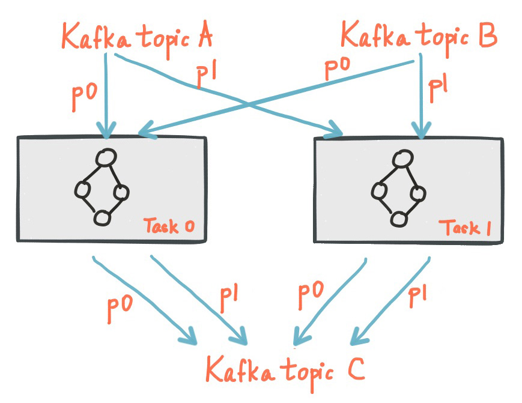
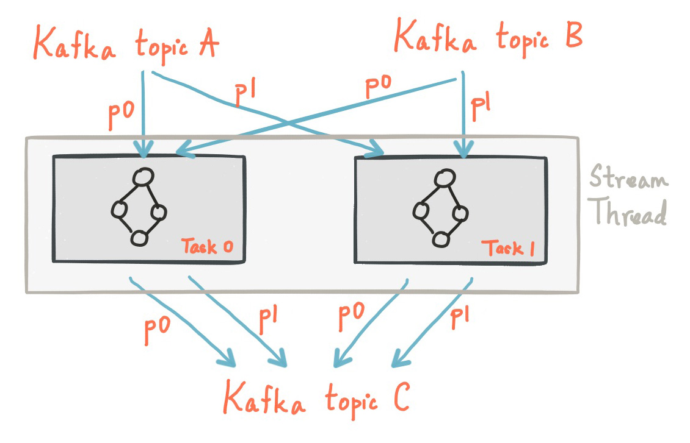
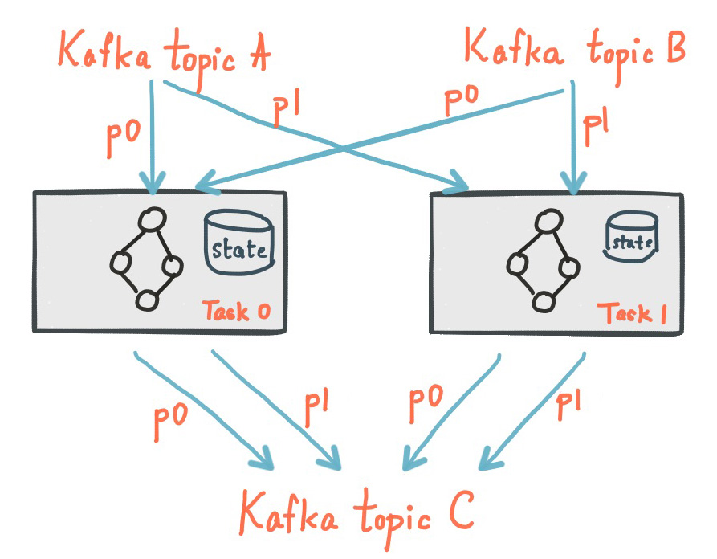

[原文地址](https://kafka.apache.org/10/documentation/streams/architecture)
# Kafka Streams 架构
Kafka Streams通过构建Kafka生产者和消费者库，并利用Kafka的本地功能来提供数据并行性，分布式协调，容错性和操作简单性，从而
简化了应用程序开发。 在本节中，我们将介绍Kafka Streams底层是如何工作的。

下图显示了使用Kafka Streams库的应用程序的解剖结构。 我们来看一些细节。

## 流分区和任务
Kafka 的消息传递层用于存储和传输数据。 Kafka 流分区数据进行处理。 在这两种情况下，这种分区都可以实现数据的局部性，弹性，可伸缩性，高性能和容错性。 Kafka Streams使用分区和任务的概念作为基于Kafka主题分区的并行模型的逻辑单元。 在平行的背景下，Kafka Streams 和 Kafka 之间有着密切的联系：
- 每个流分区是一个完全有序的数据记录序列，并映射到一个Kafka主题分区。
- 流中的数据记录映射到该主题的Kafka消息。
- 数据记录的关键字确定Kafka和Kafka Streams 中数据的分区，即数据如何路由到主题内的特定分区。

将应用程序的处理器拓扑结构分解为多个任务。 更具体地说，Kafka Streams根据应用程序的输入流分区创建固定数量的任务，每个任务分配一个来自输入流（即Kafka主题）的分区列表。 分配给任务的分配不会改变，因此每个任务都是应用程序的固定并行单元。 然后任务可以基于所分配的分区实例化它们自己的处理器拓扑; 他们还为每个分配的分区保留一个缓冲区，并从这些记录缓冲区一次一个地处理消息。 因此，流任务可以独立并行处理，无需人工干预。

了解Kafka Streams不是资源管理器，而是在运行流处理应用程序的任何地方“运行”的库是很重要的。 应用程序的多个实例可以在同一台机器上执行，也可以分布在多台机器上，任务可以由库自动分配给正在运行的应用程序实例。 分区任务的分配不会改变; 如果应用程序实例失败，则其所有分配的任务将在其他实例上自动重新启动，并继续从相同的流分区中使用。

下图显示了两个任务，每个任务分配一个输入流分区。

## 线程模型
Kafka Streams允许用户配置库可用于在应用程序实例中并行处理的线程数。 每个线程都可以独立执行一个或多个具有处理器拓扑的任务。 例如，下图显示了一个运行两个流任务的流线程。

启动更多的流线程或应用程序的更多实例仅仅是复制拓扑并使其处理不同的Kafka分区子集，从而有效地并行处理。 值得注意的是线程之间没有共享状态，所以不需要线程间的协调。 这使得跨应用程序实例和线程并行运行拓扑非常简单。 Kafka Streams利用Kafka的协调功能透明地处理各个流线程之间的Kafka主题分区。

如上所述，使用Kafka Streams扩展流处理应用程序非常简单：只需启动应用程序的其他实例，而Kafka Streams负责在应用程序实例中运行的任务之间分配分区。 您可以启动与输入Kafka主题分区相同数量的应用程序线程，以便在应用程序的所有正在运行的实例中，每个线程（或者说运行的任务）都至少有一个输入分区可供处理。

## 本地状态存储
Kafka Streams提供了所谓的状态存储，可以被流处理应用程序用来存储和查询数据，这是实现有状态操作时的一个重要功能。 例如，Kafka Streams DSL在您调用诸如join（）或aggregate（）之类的有状态运算符时，或者当您正在对流进行窗口化时，会自动创建和管理这些状态存储。

Kafka Streams应用程序中的每个流任务都可以嵌入一个或多个可通过API访问的本地状态存储，以存储和查询处理所需的数据。 Kafka Streams为这类本地状态存储提供容错和自动恢复功能。

下图显示了具有专用本地状态存储的两个流任务。

## 容错
Kafka Streams基于 Kafka 内部的本地集成的容错功能。 Kafka 分区是高度可用和复制; 所以当流数据持久化到Kafka时，即使应用程序失败并需要重新处理，也是可用的。 Kafka流中的任务利用Kafka客户端提供的容错功能来处理故障。 如果某个任务在发生故障的计算机上运行，则Kafka Streams会自动在应用程序的其中一个正在运行的实例中重新启动该任务。

另外，Kafka Streams也确保本地状态存储也对失败有强大的作用。 对于每个状态存储，它维护一个复制的更改日志Kafka主题，其中跟踪任何状态更新。 这些更改日志主题也进行了分区，以便每个本地状态存储实例以及因此访问存储的任务都有其自己的专用更改日志主题分区。 [日志压缩](https://kafka.apache.org/10/documentation/#compaction)在更改日志主题上启用，以便可以安全地清除旧数据以防止主题无限增长。 如果任务在失败的计算机上运行，并在另一台计算机上重新启动，则Kafka Streams保证在恢复对新启动的任务的处理之前，通过重播相应的更改日志主题，将其关联的状态存储恢复到失败前的内容。 因此，故障处理对最终用户是完全透明的。

请注意，任务（重新）初始化的成本通常主要取决于通过重播状态存储库的相关更改日志主题来恢复状态的时间。 为了最小化这种恢复时间，用户可以将其应用程序配置为具有本地状态的备用副本（即状态的完全复制副本）。 当发生任务迁移时，Kafka Streams会尝试将任务分配给应用程序实例，在该应用程序实例中已经存在这样的备用副本，以最大限度地减少任务（重新）初始化成本。 请参阅[Kafka Streams配置](https://kafka.apache.org/10/documentation/#streamsconfigs)部分中的num.standby.replicas。
