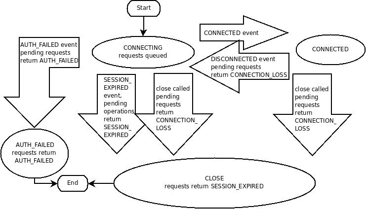

[原文地址](http://zookeeper.apache.org/doc/current/zookeeperProgrammers.html)
[本文地址](https://github.com/Everything2CN/Zookeeper-CN/tree/master/3.%20Programmer's%20Guide)
# 介绍
本文档是希望创建利用ZooKeeper协调服务的分布式应用程序的开发人员的指南。 它包含概念和实用信息。

本指南的前四部分介绍了各种ZooKeeper概念的更高级别讨论。 这些对于理解ZooKeeper如何工作以及如何使用它们都是必要的。 它不包含源代码，但它确实熟悉与分布式计算相关的问题。 第一组中的部分是：
- ZooKeeper数据模型
- ZooKeeper会话
- ZooKeeper监视
- 一致性保证

接下来的四节提供了实用的编程信息。 这些是：
- 构建模块：ZooKeeper操作指南
- 绑定
- 程序结构，简单示例[tbd]
- 陷阱：常见问题和故障排除

本书最后附有一个附录，其中包含与其他有用的ZooKeeper相关信息的链接。

本文档中的大部分信息都是作为独立的参考资料编写的。 但是，在开始第一个ZooKeeper应用程序之前，您应该至少阅读[ZooKeeper数据模型](./#ZooKeeper数据模型)和[ZooKeeper基本操作](./#ZooKeeper基本操作)的章节。 此外，[简单编程](./#简单编程)示例[tbd]有助于理解ZooKeeper客户端应用程序的基本结构。

# ZooKeeper数据模型
ZooKeeper有一个分层名称空间，很像分布式文件系统。唯一的区别是命名空间中的每个节点都可以包含与之关联的数据以及子节点。这就像拥有一个允许文件也是目录的文件系统。节点的路径始终表示为规范，绝对，斜线分隔的路径;没有相对的参考。任何unicode字符都可以在受以下约束限制的路径中使用：
- null 字符（\ u0000）不能是路径名的一部分。 （这会导致C绑定出现问题。）
- 无法使用以下字符，因为它们无法正常显示或以令人困惑的方式呈现：\ u0001 - \ u0019和\ u007F - \ u009F。
- 不允许使用以下字符：\ ud800 -uF8FFF，\ uFFF0 - uFFFF。
- “.” 字符可以用作另一个名称的一部分，但是“.” 并且“...”不能单独用于表示路径上的节点，因为ZooKeeper不使用相对路径。以下内容无效：“/a/b/./c”或“/a/b/../c”。
- 令牌“zookeeper”被保留。

# ZNodes
ZooKeeper树中的每个节点都称为znode。Znodes维护一个stat结构，包括数据更改的版本号，acl更改。统计结构也有时间戳。版本号与时间戳一起允许ZooKeeper验证缓存并协调更新。每次znode的数据更改时，版本号都会增加。例如，每当客户端检索数据时，它也会接收数据的版本。当客户端执行更新或删除时，它必须提供正在更改的znode的数据版本。如果它提供的版本与实际版本的数据不匹配，则更新将失败。（可以覆盖此行为。有关详细信息，请参阅...）[tbd ...]

注意： 
	在分布式应用程序工程中，节点可以指通用主机，服务器，集合成员，客户端进程等。在ZooKeeper文档中，znodes指的是数据节点。 服务器指的是构成ZooKeeper服务的机器; 仲裁对等体是指构成整体的服务器; client指的是使用ZooKeeper服务的任何主机或进程。

znode是程序员需要注意的主要抽象。 Znodes有几个值得一提的特性。

## 监视
客户端可以在znodes上设置监视。对该znode的更改会触发监视，然后清除监视。当监视触发时，ZooKeeper会向客户端发送通知。有关监视的更多信息，请参阅[ZooKeeper监视](http://zookeeper.apache.org/doc/current/zookeeperProgrammers.html#ch_zkWatches)部分

## 数据访问
存储在命名空间中每个znode的数据以原子方式读取和写入。读取获取与znode关联的所有数据字节，写入替换所有数据。每个节点都有一个访问控制列表（ACL），限制谁可以做什么。

 ZooKeeper并非设计为通用数据库或大型对象存储库。相反，它管理协调数据。这些数据可以以配置，状态信息，会合(rendezvous)等形式出现。各种形式的协调数据的共同特性是它们相对较小：以千字节为单位。 ZooKeeper客户端和服务器实现具有健全性检查，以确保znode的数据少于1M，但数据应远低于平均值。在相对较大的数据大小上操作将导致某些操作比其他操作花费更多的时间并且将影响某些操作的延迟，因为通过网络将更多数据移动到存储介质上需要额外的时间。如果需要大数据存储，处理此类数据的通常模式是将其存储在大容量存储系统（如NFS或HDFS）上，并存储指向ZooKeeper中存储位置的指针。

## 短暂节点
ZooKeeper也有短暂节点的概念。 只要创建znode的会话处于活动状态，就会存在这些znode。 会话结束时，这些znode将被删除。 由于这种行为，短暂的znodes不允许有孩子。

## 序列节点 - 唯一命名
在创建znode时，您还可以请求ZooKeeper在路径末尾附加一个单调递增的计数器。 此计数器对于父znode是唯一的。 计数器具有％010d的格式 - 具有0（零）填充的10位数（计数器以这种方式格式化以简化排序），即“<path> 0000000001”。 有关此功能的示例用法，请参阅[队列配方](http://zookeeper.apache.org/doc/current/recipes.html#sc_recipes_Queues)。 注意：用于存储下一个序列号的计数器是由父节点维护的signed int（4bytes），当递增超过2147483647时，计数器将溢出（产生名称“<path> -2147483648”）。

# 在ZooKeeper的时间
ZooKeeper以多种方式跟踪时间：
- Zxid  :对ZooKeeper状态的每次更改都会以zxid（ZooKeeper Transaction Id）的形式接收戳记。 这暴露了ZooKeeper的所有更改的总排序。 每个更改都有一个唯一的zxid，如果zxid1小于zxid2，则zxid1发生在zxid2之前。
- Version numbers :对节点的每次更改都会导致该节点的某个版本号增加。 三个版本号是version（znode数据的更改次数），cversion（znode子项的更改次数）和aversion（znode的ACL更改次数）。
- Ticks :当使用多服务器ZooKeeper时，服务器使用滴答来定义事件的时间，例如状态上传，会话超时，对等体之间的连接超时等。滴答时间仅通过最小会话超时（滴答时间的2倍）间接暴露; 如果客户端请求的会话超时小于最小会话超时，则服务器将告诉客户端会话超时实际上是最小会话超时。
- Real time : 除了在znode创建和znode修改时将时间戳放入stat结构之外，ZooKeeper根本不使用实时或时钟时间。

# ZooKeeper统计结构
ZooKeeper中每个znode的Stat结构由以下字段组成：
- czxid :导致创建此znode的更改的zxid
- mzxid :上次修改此znode的更改的zxid。
- pzxid :最后修改此znode的子项的更改的zxid。
- ctime :创建此znode时从纪元开始的时间（以毫秒为单位）。
- mtime :上次修改此znode时的时间（以毫秒为单位）。
- version :此znode数据的更改次数。
- cversion :此znode的子项的更改数。
- aversion :此znode的ACL更改次数。
- ephemeralOwner :如果znode是短暂节点，则此znode的所有者的会话ID。如果它不是一个短暂的节点，它将为零。
- dataLength :此znode的数据字段的长度。
- numChildren :这个znode的子节点数。

# ZooKeeper会话
ZooKeeper客户端通过使用语言绑定创建服务句柄，与ZooKeeper服务建立会话。 一旦创建，句柄就会以CONNECTING状态启动，客户端库会尝试连接到构成ZooKeeper服务的其中一个服务器，此时它将切换到CONNECTED状态。 在正常操作期间将处于这两种状态之一。 如果发生不可恢复的错误，例如会话到期或身份验证失败，或者应用程序显式关闭句柄，则句柄将移至CLOSED状态。 下图显示了ZooKeeper客户端的可能状态转换：

要创建客户端会话，应用程序代码必须提供包含逗号分隔的host：port对列表的连接字符串，每个对应一个ZooKeeper服务器（例如“127.0.0.1:4545”或“127.0.0.1:3000,127.0.0.1:3001,127.0.0.1:3002”）。 ZooKeeper客户端库将选择一个任意服务器并尝试连接它。 如果此连接失败，或者客户端因任何原因与服务器断开连接，客户端将自动尝试列表中的下一个服务器，直到（重新）建立连接。

3.2.0中添加:可选的“chroot”后缀也可以附加到连接字符串。这将在解释相对于此根的所有路径时运行客户端命令（类似于unix chroot命令）。如果使用，示例将如下所示：“127.0.0.1:4545/app/a”或“127.0.0.1:3000,127.0.0.1:3001,127.0.0.1:3002/app/a”，其中客户端将根植于“/ app / a”和所有路径都是相对于这个根 - 即获取/设置/等。“/foo/bar”将导致操作在“/app/a/foo/bar”上运行（来自服务器角度）。此功能在多租户环境中特别有用，其中特定ZooKeeper服务的每个用户可以以不同方式植根。这使得重用变得更加简单，因为每个用户可以将他/她的应用程序编码为好像它的根目录为“/”，而实际位置（比如/app/a）可以在部署时确定。

当客户端获取ZooKeeper服务的句柄时，ZooKeeper会创建一个ZooKeeper会话，表示为64位数，并分配给客户端。如果客户端连接到不同的ZooKeeper服务器，它将发送会话ID作为连接握手的一部分。作为安全措施，服务器为任何ZooKeeper服务器可以验证的会话ID创建密码。当客户端建立会话时，密码将以会话ID发送到客户端。只要客户端使用新服务器重新建立会话，客户端就会使用会话ID发送此密码。

ZooKeeper客户端库调用创建ZooKeeper会话的参数之一是会话超时（以毫秒为单位）。客户端发送请求的超时，服务器响应它可以给客户端的超时。当前实现要求超时至少为tickTime的2倍（在服务器配置中设置），最多为tickTime的20倍。 ZooKeeper客户端API允许访问协商的超时。

当客户端（会话）从ZK服务群集分区时，它将开始搜索在会话创建期间指定的服务器列表。最终，当重新建立客户端与至少一个服务器之间的连接时，会话将再次转换到“已连接”状态（如果在会话超时值内重新连接），或者它将转换到“已过期”状态（如果在会话超时后重新连接）。不建议在断开连接时创建新的会话对象（c绑定中的新ZooKeeper.class或zookeeper句柄）。 ZK客户端库将为您处理重新连接。特别是我们在客户端库中内置了一些启发式方法来处理诸如“群体效应”之类的事情......只有在收到会话到期通知时才会创建一个新会话（强制）。

会话到期由ZooKeeper集群本身管理，而不是由客户端管理。当ZK客户端与群集建立会话时，它提供上面详述的“超时”值。群集使用此值来确定客户端会话何时到期。当群集在指定的会话超时期限内没有从客户端收到消息（即没有心跳）时，就会发生过期。在会话到期时，群集将删除该会话拥有的任何/所有短暂节点，并立即通知任何/所有连接的客户端该更改（任何人观看这些znode）。此时，过期会话的客户端仍然与群集断开连接，除非能够重新建立与群集的连接，否则不会通知会话过期。客户端将保持断开连接状态，直到与群集重新建立TCP连接，此时过期会话的观察者将收到“会话过期”通知。

过期会话的观察者看到的过期会话的状态转换示例：
1. 'connected'：建立会话，客户端与集群通信（客户端/服务器通信正常运行）
2. ....客户端是从群集分区的
3. 'disconnected'：客户端已失去与群集的连接
4. ....时间过去，在“超时”时间段之后，群集使会话到期，客户端看不到任何内容，因为它与群集断开连接
5. ....时间流逝，客户端重新获得与群集的网络级连接
6. 'expired'：最终客户端重新连接到群集，然后通知它到期

ZooKeeper会话建立调用的另一个参数是默认观察者。当客户端发生任何状态更改时，会通知监视器。例如，如果客户端失去与服务器的连接，将通知客户端，或者客户端的会话到期等等......此观察者应该考虑将初始状态断开（即在任何状态更改事件发送给观察者之前）客户端lib）。在新连接的情况下，发送给观察者的第一个事件通常是会话连接事件。

会话由客户端发送的请求保持活动状态。如果会话空闲一段时间会使会话超时，则客户端将发送PING请求以使会话保持活动状态。此PING请求不仅允许ZooKeeper服务器知道客户端仍处于活动状态，而且还允许客户端验证其与ZooKeeper服务器的连接是否仍处于活动状态。 PING的时间足够保守，以确保合理的时间来检测死连接并重新连接到新服务器。

一旦成功建立（连接）与服务器的连接，基本上有两种情况，即客户端lib生成connectionloss（c绑定中的结果代码，Java中的异常 - 请参阅API文档以获取绑定特定详细信息） 执行异步操作，并执行以下操作之一：
1. 应用程序在不再存活/有效的会话上调用操作
2. 当存在对该服务器的待处理操作时，ZooKeeper客户端与服务器断开连接，即存在未决的异步调用。

在3.2.0中添加 - SessionMovedException。有一个内部异常通常被称为SessionMovedException的客户端看不到。 发生此异常的原因是在已在其他服务器上重新建立的会话的连接上收到请求。 此错误的正常原因是客户端向服务器发送请求，但网络数据包延迟，因此客户端超时并连接到新服务器。 当延迟数据包到达第一个服务器时，旧服务器检测到会话已移动，并关闭客户端连接。 客户端通常不会看到此错误，因为它们不会从这些旧连接中读取。 （旧连接通常是关闭的。）可以看到这种情况的一种情况是两个客户端尝试使用保存的会话ID和密码重新建立相同的连接。 其中一个客户端将重新建立连接，第二个客户端将断开连接（导致该对尝试无限期地重新建立其连接/会话）。

# ZooKeeper监视器
ZooKeeper中的所有读取操作 - getData（），getChildren（）和exists（） - 都可以选择将监视设置为副作用。这是ZooKeeper对监视器的定义：监视事件是一次性触发，发送给设置监视器的客户端，当监视器设置的数据发生变化时会发生这种情况。 在这个监视器的定义中需要考虑三个关键点：
- 一次性触发：
当数据发生变化时，将向客户端发送一个监视事件。 例如，如果客户端执行getData（“/znode1”，true），稍后更改或删除/znode1的数据，则客户端将获得/znode1的监视事件。 如果/znode1再次更改，则除非客户端已执行另一次设置新监视的读取，否则不会发送监视事件。
- 发送给客户端
这意味着事件正在前往客户端，但在更改操作的成功返回代码到达发起更改的客户端之前可能无法到达客户端。监视器以异步方式发送给观察者。ZooKeeper提供了一个订购保证：在第一次看到监视事件之前，客户端永远不会看到设置监视的更改。网络延迟或其他因素可能导致不同的客户端在不同时间看到更新的监视器和返回代码。关键是不同客户看到的所有东西都会有一致的顺序。
- 监视器设置的数据
这指的是节点可以改变的不同方式。将ZooKeeper视为维护两个监视器列表是有帮助的：数据监视器和子节点监视器。getData（）和exists（）设置数据监视。getChildren（）设置子节点监视器。或者，可以根据返回的数据类型来考虑设置监视器。 getData（）和exists（）返回有关节点数据的信息，而getChildren（）返回子节点列表。 因此，setData（）将触发正在设置的znode的数据监视（假设该集成功）。 成功的create（）将触发正在创建的znode的数据监视和子监视父znode。 成功的delete（）将触发数据监视和子监视（因为没有更多子项），因为要删除的znode以及父znode的子监视。

监视器在客户端连接的ZooKeeper服务器本地维护。 这使得监视器可以轻量化以进行设置，维护和调度。 当客户端连接到新服务器时，将针对任何会话事件触发监视。 从服务器断开连接时将不会收到监视。 当客户重新连接时，任何以前注册的监视器将被重新注册并在需要时触发。 一般来说，这一切都是透明的。 有一种情况可能会遗漏监视：如果在断开连接时创建并删除了znode，则会遗漏监视中是否存在尚未创建的znode。
# 目录
- [概述](../1.%20Overview/README.md)
- [入门指南](../2.%20Getting%20Started/README.md)
- [程序员指南](../3.%20Programmer's%20Guide/README.md)
- [食谱](../4.%20Recipes/README.md)